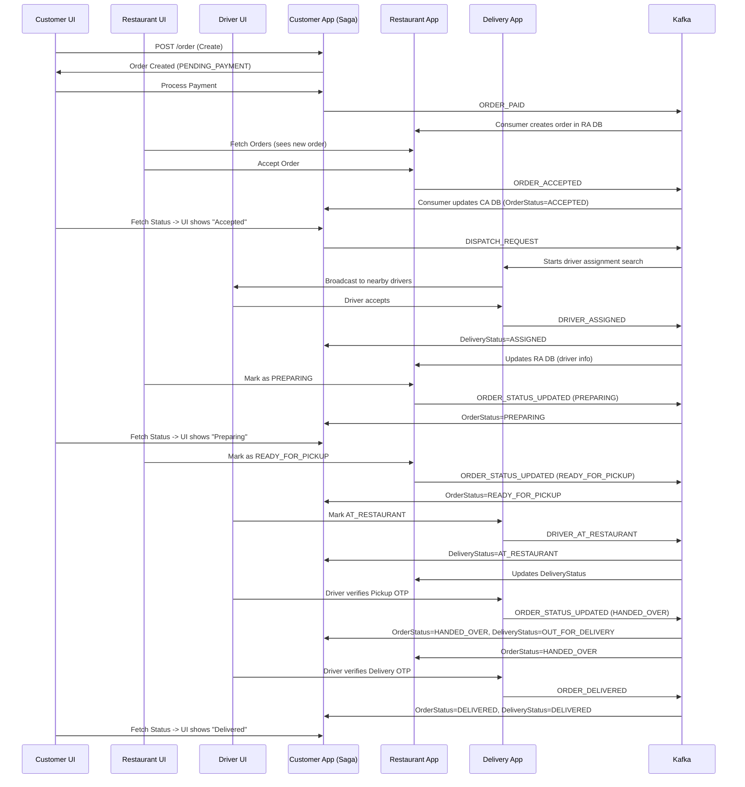
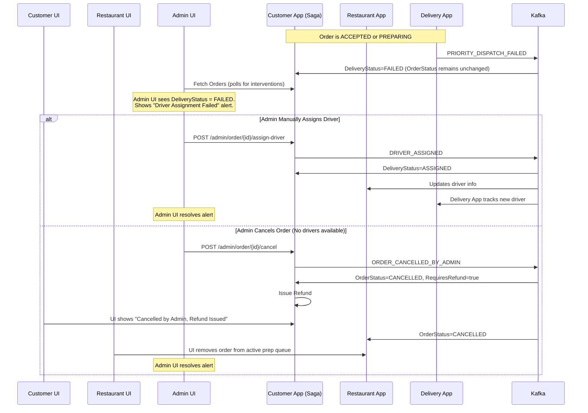
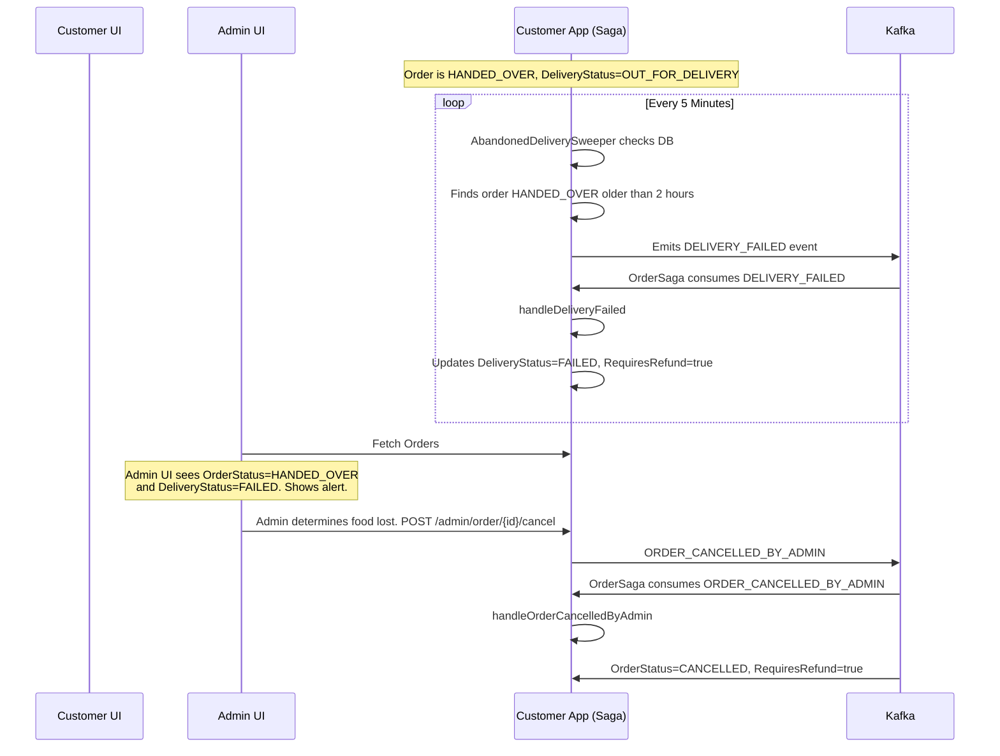
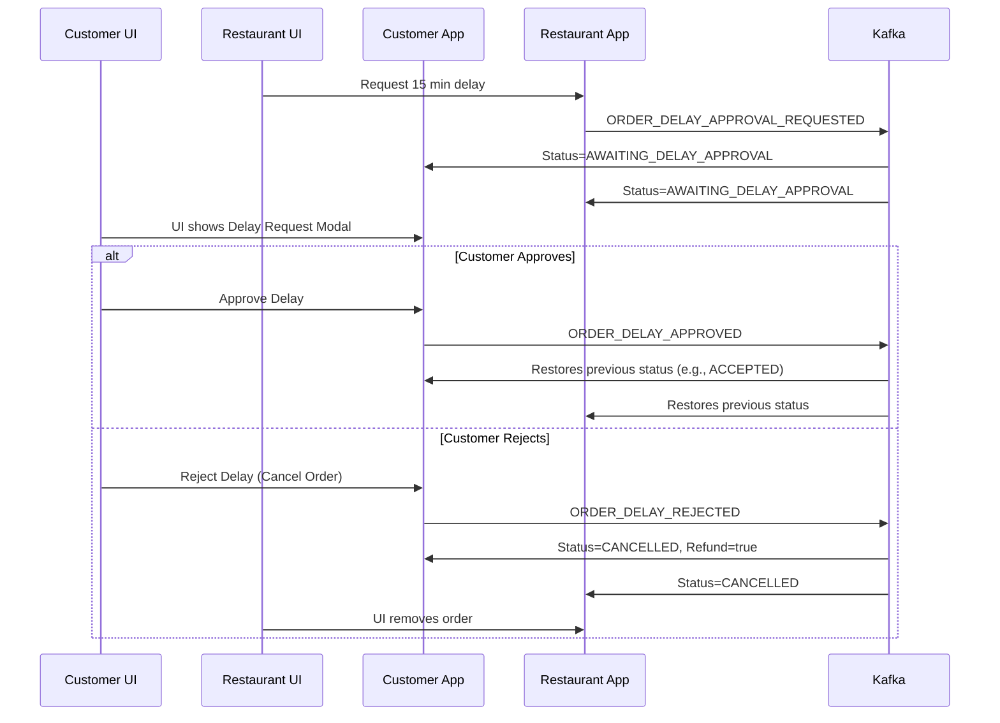
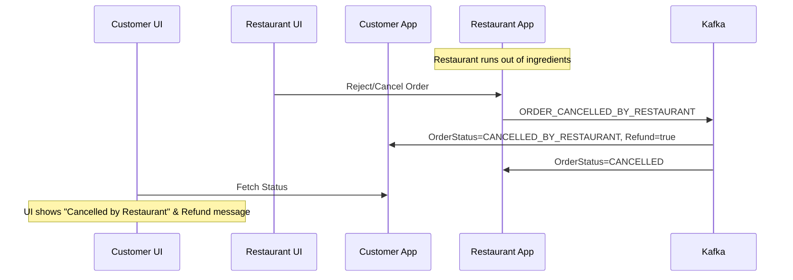
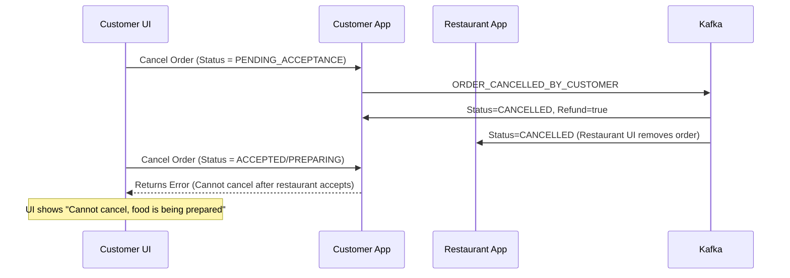
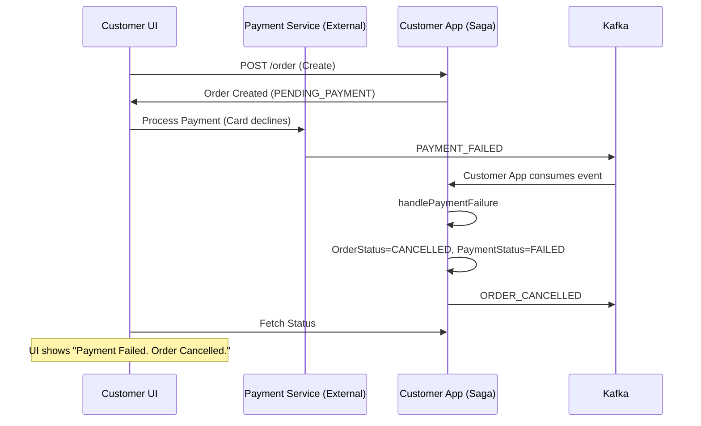
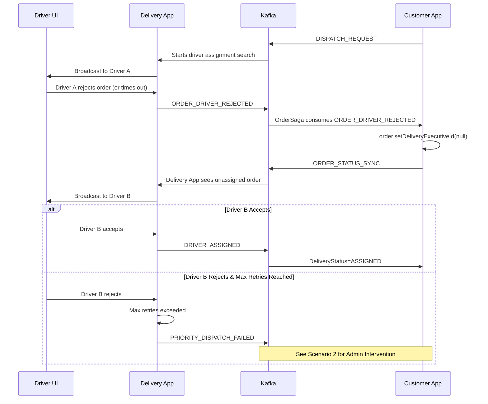
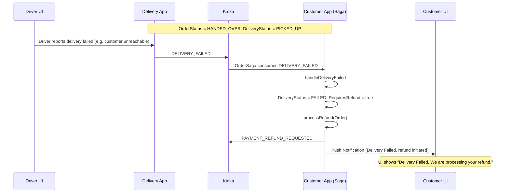
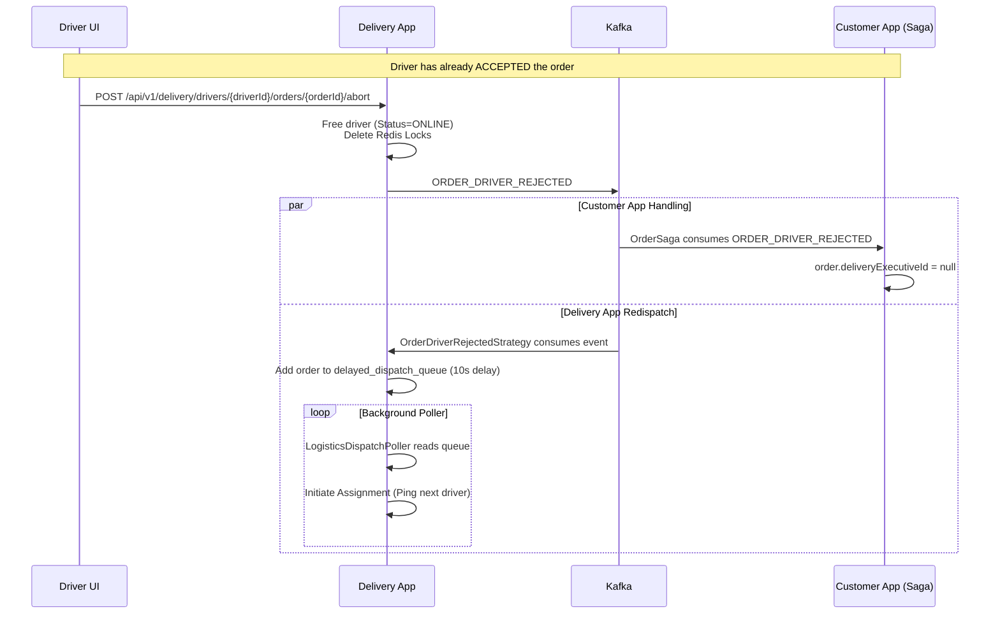

# End-to-End Flow Diagrams and Scenarios

This document outlines the end-to-end data communication, state transitions, and UI updates for all possible scenarios in the Food Delivery platform. It incorporates the decoupled `OrderStatus` and `DeliveryStatus` architecture.

## 1. Happy Path: End-to-End Delivery

## 2. Dispatch Failure & Admin Intervention

When the delivery service cannot find a driver, the food might still be cooking. We decouple the delivery state so the food isn't wasted, and admin intervention is required.

## 3. Abandoned Delivery & Admin Intervention

If a driver picks up the order but vanishes or fails to deliver within a set time frame (e.g., 2 hours).

## 4. Delay Requested by Restaurant

## 5. Restaurant Cancellation

## 6. Customer Cancellation (Before vs After Acceptance)

## 7. Payment Failure

## 8. Driver Rejection & Re-Dispatch

If the first matched driver rejects the order or times out, the system must loop and attempt to find another driver before finally resorting to `PRIORITY_DISPATCH_FAILED`.

## 9. Delivery Failed (Post-Pickup)

This scenario occurs when the driver has already picked up the food from the restaurant but is unable to deliver it to the customer (e.g., driver vehicle breakdown, customer unreachable at location, address invalid).

## 10. Driver Aborts Delivery (Emergency)

If a driver has already accepted the order but experiences an emergency (e.g., vehicle breakdown) before picking up the food, they can abort the delivery. This immediately unassigns them, frees them up in the pool (or puts them offline), and re-triggers the dispatch loop.

