# Refund Flow Diagrams — All Scenarios

> Comprehensive mermaid sequence and flow diagrams for every refund scenario in the Food Delivery platform. Each diagram shows the complete inter-service communication, state transitions, and financial flows.

---

## 1. Full Refund — Standard Flow (Cancellation by Restaurant)

The canonical refund flow used by most cancellation scenarios. This pattern is reused across restaurant rejection, admin cancellation, delay rejection, and delivery failure.

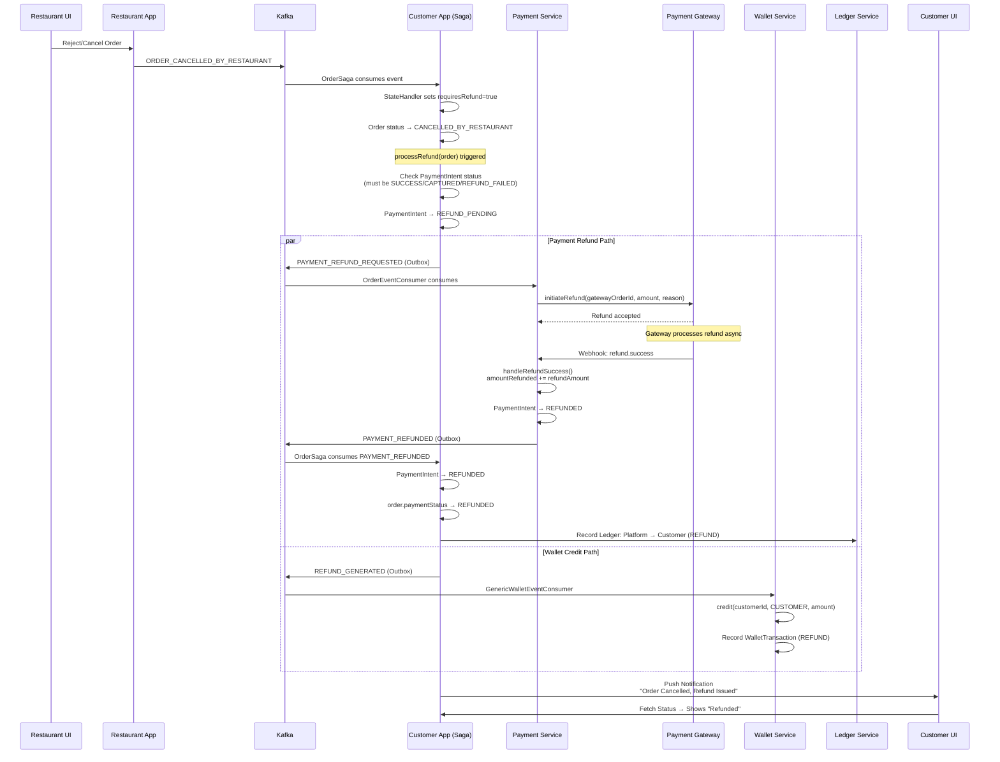
```mermaid
sequenceDiagram
    participant RUI as Restaurant UI
    participant RA as Restaurant App
    participant K as Kafka
    participant CA as Customer App (Saga)
    participant PS as Payment Service
    participant GW as Payment Gateway
    participant WS as Wallet Service
    participant LS as Ledger Service
    participant CUI as Customer UI

    RUI->>RA: Reject/Cancel Order
    RA->>K: ORDER_CANCELLED_BY_RESTAURANT
    
    K->>CA: OrderSaga consumes event
    CA->>CA: StateHandler sets requiresRefund=true
    CA->>CA: Order status → CANCELLED_BY_RESTAURANT
    
    Note over CA: processRefund(order) triggered
    CA->>CA: Check PaymentIntent status<br>(must be SUCCESS/CAPTURED/REFUND_FAILED)
    CA->>CA: PaymentIntent → REFUND_PENDING
    
    par Payment Refund Path
        CA->>K: PAYMENT_REFUND_REQUESTED (Outbox)
        K->>PS: OrderEventConsumer consumes
        PS->>GW: initiateRefund(gatewayOrderId, amount, reason)
        GW-->>PS: Refund accepted
        
        Note over GW: Gateway processes refund async
        GW->>PS: Webhook: refund.success
        PS->>PS: handleRefundSuccess()<br>amountRefunded += refundAmount
        PS->>PS: PaymentIntent → REFUNDED
        PS->>K: PAYMENT_REFUNDED (Outbox)
        
        K->>CA: OrderSaga consumes PAYMENT_REFUNDED
        CA->>CA: PaymentIntent → REFUNDED
        CA->>CA: order.paymentStatus → REFUNDED
        CA->>LS: Record Ledger: Platform → Customer (REFUND)
    and Wallet Credit Path
        CA->>K: REFUND_GENERATED (Outbox)
        K->>WS: GenericWalletEventConsumer
        WS->>WS: credit(customerId, CUSTOMER, amount)
        WS->>WS: Record WalletTransaction (REFUND)
    end
    
    CA->>CUI: Push Notification<br>"Order Cancelled, Refund Issued"
    CUI->>CA: Fetch Status → Shows "Refunded"
```

---

## 2. Customer Cancellation Before Restaurant Accepts

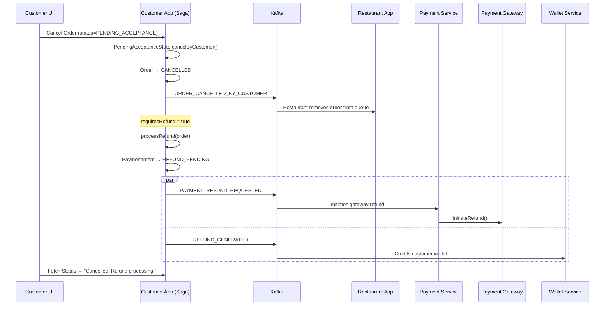
```mermaid
sequenceDiagram
    participant CUI as Customer UI
    participant CA as Customer App (Saga)
    participant K as Kafka
    participant RA as Restaurant App
    participant PS as Payment Service
    participant GW as Payment Gateway
    participant WS as Wallet Service

    CUI->>CA: Cancel Order (status=PENDING_ACCEPTANCE)
    CA->>CA: PendingAcceptanceState.cancelByCustomer()
    CA->>CA: Order → CANCELLED
    CA->>K: ORDER_CANCELLED_BY_CUSTOMER
    K->>RA: Restaurant removes order from queue
    
    Note over CA: requiresRefund = true
    CA->>CA: processRefund(order)
    CA->>CA: PaymentIntent → REFUND_PENDING
    
    par
        CA->>K: PAYMENT_REFUND_REQUESTED
        K->>PS: Initiates gateway refund
        PS->>GW: initiateRefund()
    and
        CA->>K: REFUND_GENERATED
        K->>WS: Credits customer wallet
    end
    
    CUI->>CA: Fetch Status → "Cancelled. Refund processing."
```

---

## 3. Admin Cancellation — All States

This diagram shows how admin cancellation works identically across all non-terminal states, with the exception of `CREATED` (conditional refund).

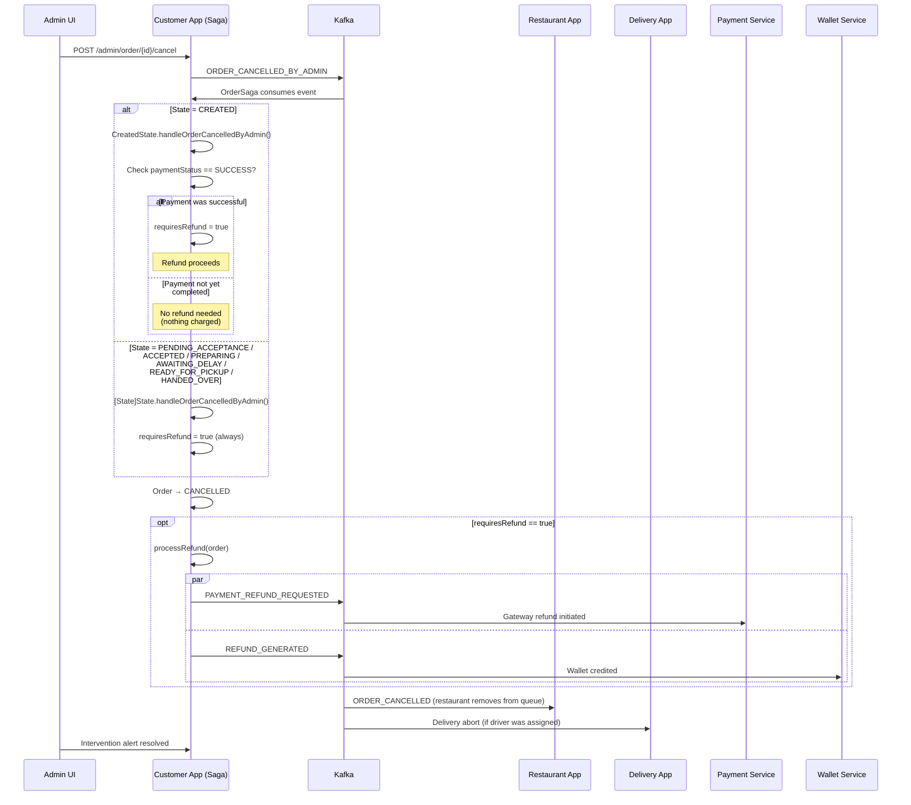
```mermaid
sequenceDiagram
    participant AUI as Admin UI
    participant CA as Customer App (Saga)
    participant K as Kafka
    participant RA as Restaurant App
    participant DA as Delivery App
    participant PS as Payment Service
    participant WS as Wallet Service

    AUI->>CA: POST /admin/order/{id}/cancel
    CA->>K: ORDER_CANCELLED_BY_ADMIN

    K->>CA: OrderSaga consumes event
    
    alt State = CREATED
        CA->>CA: CreatedState.handleOrderCancelledByAdmin()
        CA->>CA: Check paymentStatus == SUCCESS?
        alt Payment was successful
            CA->>CA: requiresRefund = true
            Note over CA: Refund proceeds
        else Payment not yet completed
            Note over CA: No refund needed<br>(nothing charged)
        end
    else State = PENDING_ACCEPTANCE / ACCEPTED / PREPARING / AWAITING_DELAY / READY_FOR_PICKUP / HANDED_OVER
        CA->>CA: [State]State.handleOrderCancelledByAdmin()
        CA->>CA: requiresRefund = true (always)
    end
    
    CA->>CA: Order → CANCELLED
    
    opt requiresRefund == true
        CA->>CA: processRefund(order)
        par
            CA->>K: PAYMENT_REFUND_REQUESTED
            K->>PS: Gateway refund initiated
        and
            CA->>K: REFUND_GENERATED
            K->>WS: Wallet credited
        end
    end

    K->>RA: ORDER_CANCELLED (restaurant removes from queue)
    K->>DA: Delivery abort (if driver was assigned)
    AUI->>CA: Intervention alert resolved
```

---

## 4. Delay Approval Refund Scenarios

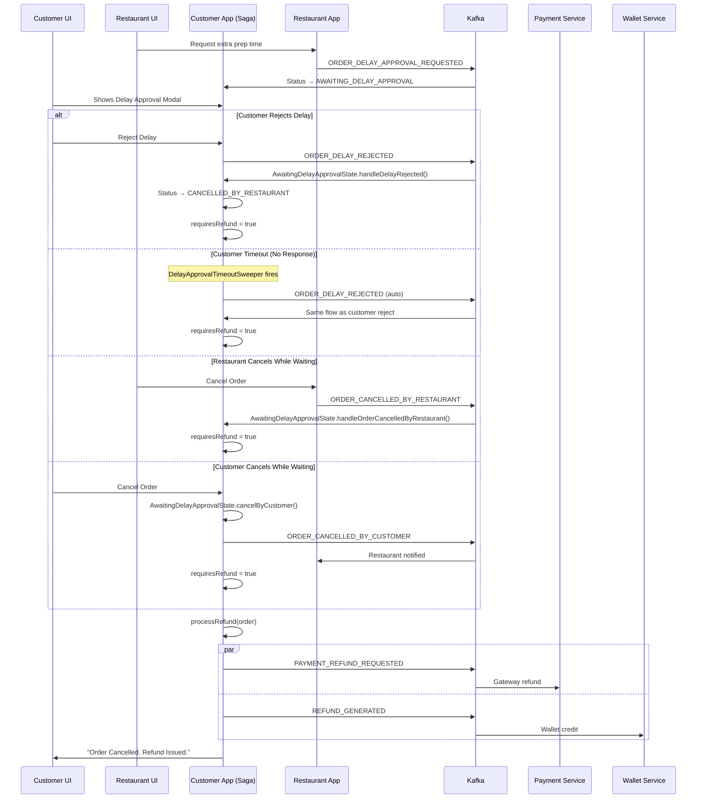
```mermaid
sequenceDiagram
    participant CUI as Customer UI
    participant RUI as Restaurant UI
    participant CA as Customer App (Saga)
    participant RA as Restaurant App
    participant K as Kafka
    participant PS as Payment Service
    participant WS as Wallet Service

    %% Restaurant requests delay
    RUI->>RA: Request extra prep time
    RA->>K: ORDER_DELAY_APPROVAL_REQUESTED
    K->>CA: Status → AWAITING_DELAY_APPROVAL
    CUI->>CA: Shows Delay Approval Modal

    alt Customer Rejects Delay
        CUI->>CA: Reject Delay
        CA->>K: ORDER_DELAY_REJECTED
        K->>CA: AwaitingDelayApprovalState.handleDelayRejected()
        CA->>CA: Status → CANCELLED_BY_RESTAURANT
        CA->>CA: requiresRefund = true
    else Customer Timeout (No Response)
        Note over CA: DelayApprovalTimeoutSweeper fires
        CA->>K: ORDER_DELAY_REJECTED (auto)
        K->>CA: Same flow as customer reject
        CA->>CA: requiresRefund = true
    else Restaurant Cancels While Waiting
        RUI->>RA: Cancel Order
        RA->>K: ORDER_CANCELLED_BY_RESTAURANT
        K->>CA: AwaitingDelayApprovalState.handleOrderCancelledByRestaurant()
        CA->>CA: requiresRefund = true
    else Customer Cancels While Waiting
        CUI->>CA: Cancel Order
        CA->>CA: AwaitingDelayApprovalState.cancelByCustomer()
        CA->>K: ORDER_CANCELLED_BY_CUSTOMER
        K->>RA: Restaurant notified
        CA->>CA: requiresRefund = true
    end

    %% All paths lead to refund
    CA->>CA: processRefund(order)
    par
        CA->>K: PAYMENT_REFUND_REQUESTED
        K->>PS: Gateway refund
    and
        CA->>K: REFUND_GENERATED
        K->>WS: Wallet credit
    end
    CA->>CUI: "Order Cancelled. Refund Issued."
```

---

## 5. Delivery Failure Refund (Post-Pickup)

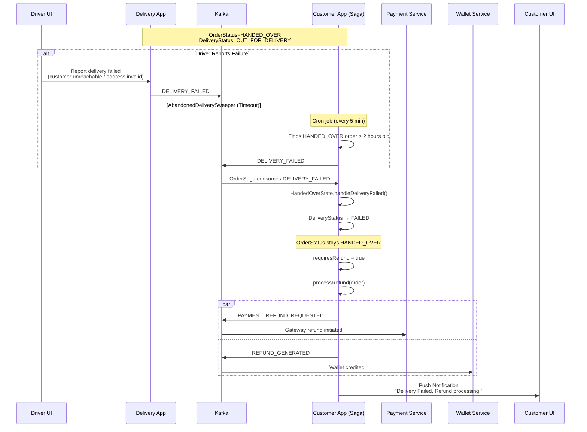
```mermaid
sequenceDiagram
    participant DUI as Driver UI
    participant DA as Delivery App
    participant K as Kafka
    participant CA as Customer App (Saga)
    participant PS as Payment Service
    participant WS as Wallet Service
    participant CUI as Customer UI

    Note over DA,CA: OrderStatus=HANDED_OVER<br>DeliveryStatus=OUT_FOR_DELIVERY

    alt Driver Reports Failure
        DUI->>DA: Report delivery failed<br>(customer unreachable / address invalid)
        DA->>K: DELIVERY_FAILED
    else AbandonedDeliverySweeper (Timeout)
        Note over CA: Cron job (every 5 min)
        CA->>CA: Finds HANDED_OVER order > 2 hours old
        CA->>K: DELIVERY_FAILED
    end

    K->>CA: OrderSaga consumes DELIVERY_FAILED
    CA->>CA: HandedOverState.handleDeliveryFailed()
    CA->>CA: DeliveryStatus → FAILED
    Note over CA: OrderStatus stays HANDED_OVER
    CA->>CA: requiresRefund = true
    
    CA->>CA: processRefund(order)
    par
        CA->>K: PAYMENT_REFUND_REQUESTED
        K->>PS: Gateway refund initiated
    and
        CA->>K: REFUND_GENERATED
        K->>WS: Wallet credited
    end
    
    CA->>CUI: Push Notification<br>"Delivery Failed. Refund processing."
```

---

## 6. Late Payment on Cancelled Order (TerminalState Auto-Refund)

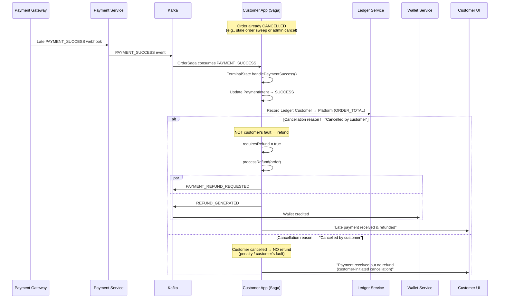
```mermaid
sequenceDiagram
    participant GW as Payment Gateway
    participant PS as Payment Service
    participant K as Kafka
    participant CA as Customer App (Saga)
    participant LS as Ledger Service
    participant WS as Wallet Service
    participant CUI as Customer UI

    Note over CA: Order already CANCELLED<br>(e.g., stale order sweep or admin cancel)

    GW->>PS: Late PAYMENT_SUCCESS webhook
    PS->>K: PAYMENT_SUCCESS event

    K->>CA: OrderSaga consumes PAYMENT_SUCCESS
    CA->>CA: TerminalState.handlePaymentSuccess()
    
    %% Record the incoming payment first
    CA->>CA: Update PaymentIntent → SUCCESS
    CA->>LS: Record Ledger: Customer → Platform (ORDER_TOTAL)
    
    alt Cancellation reason != "Cancelled by customer"
        Note over CA: NOT customer's fault → refund
        CA->>CA: requiresRefund = true
        CA->>CA: processRefund(order)
        par
            CA->>K: PAYMENT_REFUND_REQUESTED
        and
            CA->>K: REFUND_GENERATED
            K->>WS: Wallet credited
        end
        CA->>CUI: "Late payment received & refunded"
    else Cancellation reason == "Cancelled by customer"
        Note over CA: Customer cancelled → NO refund<br>(penalty / customer's fault)
        CA->>CUI: "Payment received but no refund<br>(customer-initiated cancellation)"
    end
```

---

## 7. Partial Refund Flow (Item Unavailable)

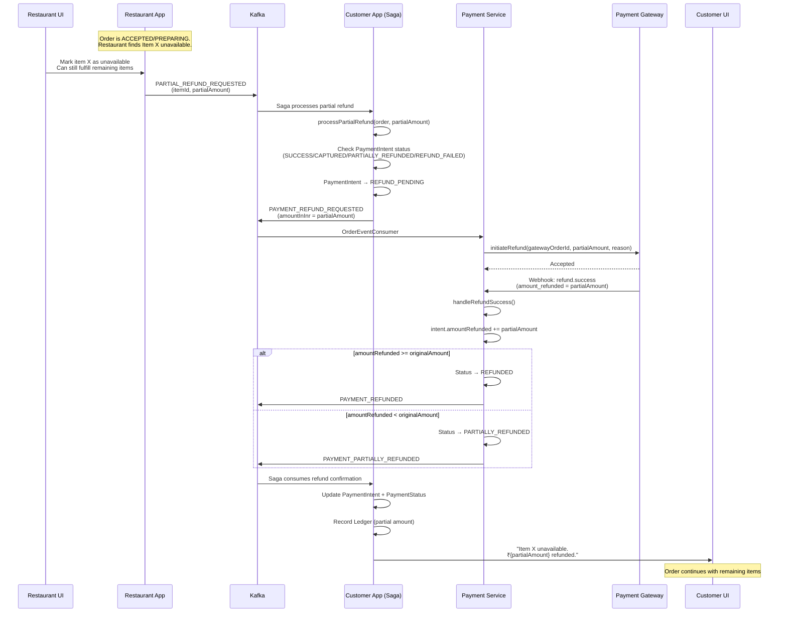
```mermaid
sequenceDiagram
    participant RUI as Restaurant UI
    participant RA as Restaurant App
    participant K as Kafka
    participant CA as Customer App (Saga)
    participant PS as Payment Service
    participant GW as Payment Gateway
    participant CUI as Customer UI

    Note over RA: Order is ACCEPTED/PREPARING.<br>Restaurant finds Item X unavailable.

    RUI->>RA: Mark item X as unavailable<br>Can still fulfill remaining items
    RA->>K: PARTIAL_REFUND_REQUESTED<br>(itemId, partialAmount)

    K->>CA: Saga processes partial refund
    CA->>CA: processPartialRefund(order, partialAmount)
    
    CA->>CA: Check PaymentIntent status<br>(SUCCESS/CAPTURED/PARTIALLY_REFUNDED/REFUND_FAILED)
    CA->>CA: PaymentIntent → REFUND_PENDING
    
    CA->>K: PAYMENT_REFUND_REQUESTED<br>(amountInInr = partialAmount)
    
    K->>PS: OrderEventConsumer
    PS->>GW: initiateRefund(gatewayOrderId, partialAmount, reason)
    GW-->>PS: Accepted
    
    GW->>PS: Webhook: refund.success<br>(amount_refunded = partialAmount)
    PS->>PS: handleRefundSuccess()
    PS->>PS: intent.amountRefunded += partialAmount
    
    alt amountRefunded >= originalAmount
        PS->>PS: Status → REFUNDED
        PS->>K: PAYMENT_REFUNDED
    else amountRefunded < originalAmount
        PS->>PS: Status → PARTIALLY_REFUNDED
        PS->>K: PAYMENT_PARTIALLY_REFUNDED
    end
    
    K->>CA: Saga consumes refund confirmation
    CA->>CA: Update PaymentIntent + PaymentStatus
    CA->>CA: Record Ledger (partial amount)
    
    CA->>CUI: "Item X unavailable.<br>₹{partialAmount} refunded."
    Note over CUI: Order continues with remaining items
```

---

## 8. Multiple Sequential Partial Refunds

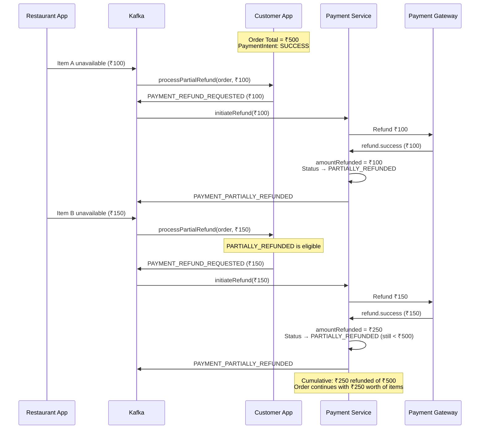
```mermaid
sequenceDiagram
    participant RA as Restaurant App
    participant K as Kafka
    participant CA as Customer App
    participant PS as Payment Service
    participant GW as Payment Gateway

    Note over CA: Order Total = ₹500<br>PaymentIntent: SUCCESS

    %% First partial refund
    RA->>K: Item A unavailable (₹100)
    K->>CA: processPartialRefund(order, ₹100)
    CA->>K: PAYMENT_REFUND_REQUESTED (₹100)
    K->>PS: initiateRefund(₹100)
    PS->>GW: Refund ₹100
    GW->>PS: refund.success (₹100)
    PS->>PS: amountRefunded = ₹100<br>Status → PARTIALLY_REFUNDED
    PS->>K: PAYMENT_PARTIALLY_REFUNDED

    %% Second partial refund
    RA->>K: Item B unavailable (₹150)
    K->>CA: processPartialRefund(order, ₹150)
    Note over CA: PARTIALLY_REFUNDED is eligible
    CA->>K: PAYMENT_REFUND_REQUESTED (₹150)
    K->>PS: initiateRefund(₹150)
    PS->>GW: Refund ₹150
    GW->>PS: refund.success (₹150)
    PS->>PS: amountRefunded = ₹250<br>Status → PARTIALLY_REFUNDED (still < ₹500)
    PS->>K: PAYMENT_PARTIALLY_REFUNDED

    Note over PS: Cumulative: ₹250 refunded of ₹500<br>Order continues with ₹250 worth of items
```

---

## 9. Refund Failure & Recovery

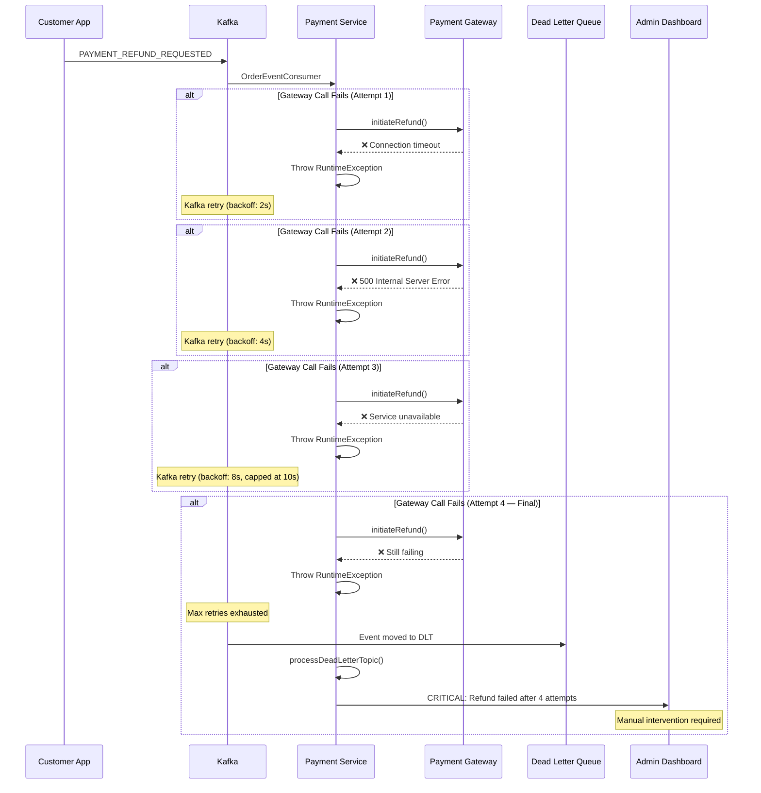
```mermaid
sequenceDiagram
    participant CA as Customer App
    participant K as Kafka
    participant PS as Payment Service
    participant GW as Payment Gateway
    participant DLQ as Dead Letter Queue
    participant Admin as Admin Dashboard

    CA->>K: PAYMENT_REFUND_REQUESTED
    K->>PS: OrderEventConsumer

    alt Gateway Call Fails (Attempt 1)
        PS->>GW: initiateRefund()
        GW-->>PS: ❌ Connection timeout
        PS->>PS: Throw RuntimeException
        Note over K: Kafka retry (backoff: 2s)
    end

    alt Gateway Call Fails (Attempt 2)
        PS->>GW: initiateRefund()
        GW-->>PS: ❌ 500 Internal Server Error
        PS->>PS: Throw RuntimeException
        Note over K: Kafka retry (backoff: 4s)
    end

    alt Gateway Call Fails (Attempt 3)
        PS->>GW: initiateRefund()
        GW-->>PS: ❌ Service unavailable
        PS->>PS: Throw RuntimeException
        Note over K: Kafka retry (backoff: 8s, capped at 10s)
    end

    alt Gateway Call Fails (Attempt 4 — Final)
        PS->>GW: initiateRefund()
        GW-->>PS: ❌ Still failing
        PS->>PS: Throw RuntimeException
        Note over K: Max retries exhausted
        K->>DLQ: Event moved to DLT
        PS->>PS: processDeadLetterTopic()
        PS->>Admin: CRITICAL: Refund failed after 4 attempts
        Note over Admin: Manual intervention required
    end
```

---

## 10. Refund Idempotency — Duplicate Prevention

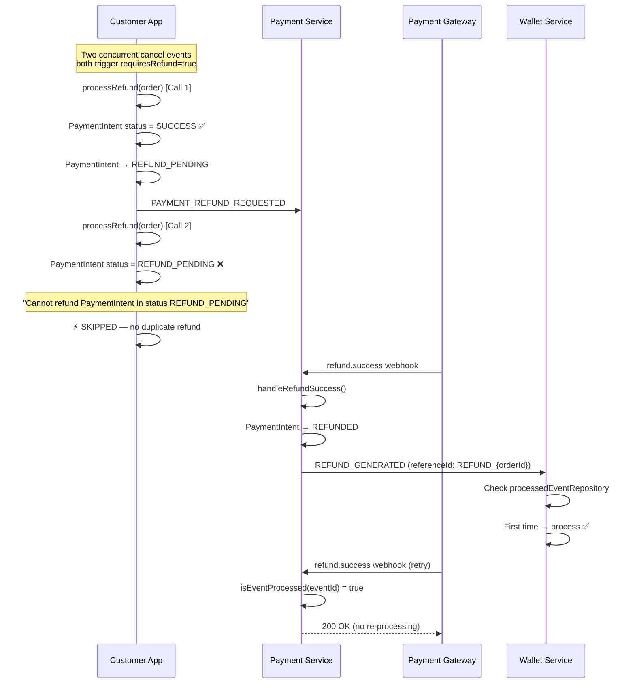
```mermaid
sequenceDiagram
    participant CA as Customer App
    participant PS as Payment Service
    participant GW as Payment Gateway
    participant WS as Wallet Service

    Note over CA: Two concurrent cancel events<br>both trigger requiresRefund=true

    %% First processRefund call
    CA->>CA: processRefund(order) [Call 1]
    CA->>CA: PaymentIntent status = SUCCESS ✅
    CA->>CA: PaymentIntent → REFUND_PENDING
    CA->>PS: PAYMENT_REFUND_REQUESTED

    %% Second processRefund call (concurrent)
    CA->>CA: processRefund(order) [Call 2]
    CA->>CA: PaymentIntent status = REFUND_PENDING ❌
    Note over CA: "Cannot refund PaymentIntent in status REFUND_PENDING"
    CA->>CA: ⚡ SKIPPED — no duplicate refund

    %% Gateway webhook arrives
    GW->>PS: refund.success webhook
    PS->>PS: handleRefundSuccess()
    PS->>PS: PaymentIntent → REFUNDED

    %% Wallet idempotency
    PS->>WS: REFUND_GENERATED (referenceId: REFUND_{orderId})
    WS->>WS: Check processedEventRepository
    WS->>WS: First time → process ✅

    %% If webhook retries
    GW->>PS: refund.success webhook (retry)
    PS->>PS: isEventProcessed(eventId) = true
    PS-->>GW: 200 OK (no re-processing)
```

---

## 11. Dispatch Failure → Admin Decision → Refund (or Not)

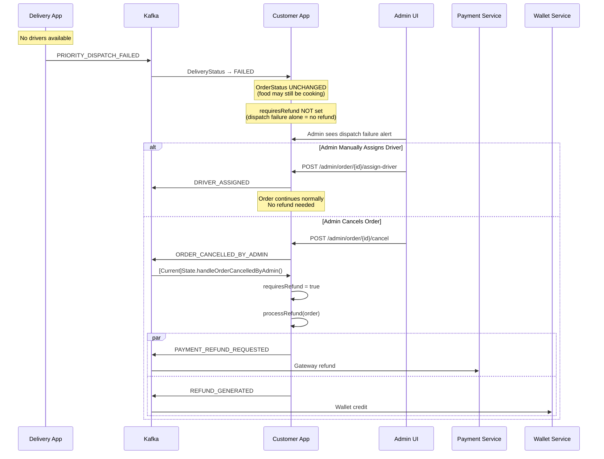
```mermaid
sequenceDiagram
    participant DA as Delivery App
    participant K as Kafka
    participant CA as Customer App
    participant AUI as Admin UI
    participant PS as Payment Service
    participant WS as Wallet Service

    Note over DA: No drivers available

    DA->>K: PRIORITY_DISPATCH_FAILED
    K->>CA: DeliveryStatus → FAILED
    Note over CA: OrderStatus UNCHANGED<br>(food may still be cooking)
    Note over CA: requiresRefund NOT set<br>(dispatch failure alone = no refund)

    AUI->>CA: Admin sees dispatch failure alert

    alt Admin Manually Assigns Driver
        AUI->>CA: POST /admin/order/{id}/assign-driver
        CA->>K: DRIVER_ASSIGNED
        Note over CA: Order continues normally<br>No refund needed
    else Admin Cancels Order
        AUI->>CA: POST /admin/order/{id}/cancel
        CA->>K: ORDER_CANCELLED_BY_ADMIN
        K->>CA: [Current]State.handleOrderCancelledByAdmin()
        CA->>CA: requiresRefund = true
        CA->>CA: processRefund(order)
        par
            CA->>K: PAYMENT_REFUND_REQUESTED
            K->>PS: Gateway refund
        and
            CA->>K: REFUND_GENERATED
            K->>WS: Wallet credit
        end
    end
```

---

## 12. Wallet Refund — Detailed Internal Flow

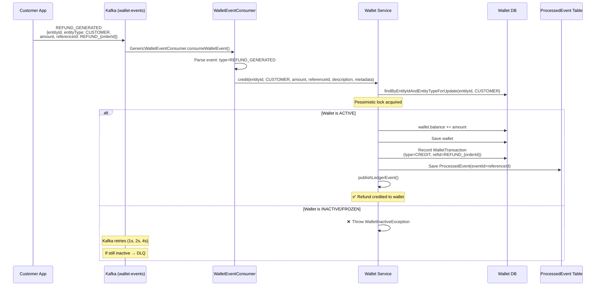
```mermaid
sequenceDiagram
    participant CA as Customer App
    participant K as Kafka (wallet-events)
    participant WC as WalletEventConsumer
    participant WS as Wallet Service
    participant DB as Wallet DB
    participant PE as ProcessedEvent Table

    CA->>K: REFUND_GENERATED<br>{entityId, entityType: CUSTOMER,<br>amount, referenceId: REFUND_{orderId}}
    
    K->>WC: GenericWalletEventConsumer.consumeWalletEvent()
    WC->>WC: Parse event: type=REFUND_GENERATED
    WC->>WS: credit(entityId, CUSTOMER, amount, referenceId, description, metadata)
    
    WS->>DB: findByEntityIdAndEntityTypeForUpdate(entityId, CUSTOMER)
    Note over WS: Pessimistic lock acquired
    
    alt Wallet is ACTIVE
        WS->>DB: wallet.balance += amount
        WS->>DB: Save wallet
        WS->>DB: Record WalletTransaction<br>(type=CREDIT, refId=REFUND_{orderId})
        WS->>PE: Save ProcessedEvent(eventId=referenceId)
        WS->>WS: publishLedgerEvent()
        Note over WS: ✅ Refund credited to wallet
    else Wallet is INACTIVE/FROZEN
        WS->>WS: ❌ Throw WalletInactiveException
        Note over K: Kafka retries (1s, 2s, 4s)
        Note over K: If still inactive → DLQ
    end
```

---

## 13. Complete Refund State Machine

This diagram shows the PaymentIntentStatus transitions specifically for refund scenarios.

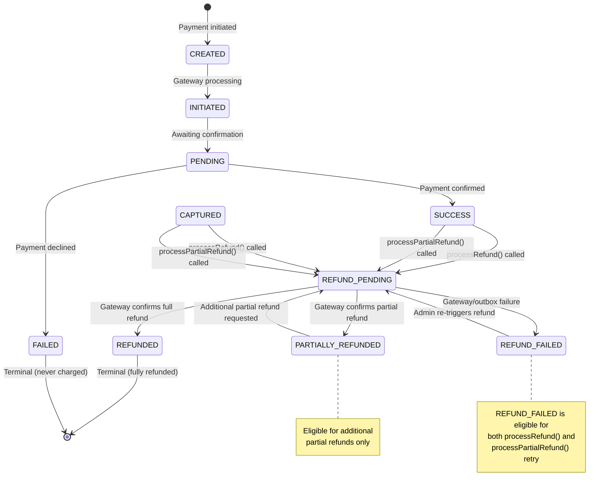
```mermaid
stateDiagram-v2
    [*] --> CREATED: Payment initiated
    CREATED --> INITIATED: Gateway processing
    INITIATED --> PENDING: Awaiting confirmation
    PENDING --> SUCCESS: Payment confirmed
    PENDING --> FAILED: Payment declined
    
    SUCCESS --> REFUND_PENDING: processRefund() called
    SUCCESS --> REFUND_PENDING: processPartialRefund() called
    
    CAPTURED --> REFUND_PENDING: processRefund() called
    CAPTURED --> REFUND_PENDING: processPartialRefund() called
    
    REFUND_PENDING --> REFUNDED: Gateway confirms full refund
    REFUND_PENDING --> PARTIALLY_REFUNDED: Gateway confirms partial refund
    REFUND_PENDING --> REFUND_FAILED: Gateway/outbox failure
    
    PARTIALLY_REFUNDED --> REFUND_PENDING: Additional partial refund requested
    
    REFUND_FAILED --> REFUND_PENDING: Admin re-triggers refund
    
    REFUNDED --> [*]: Terminal (fully refunded)
    FAILED --> [*]: Terminal (never charged)
    
    note right of REFUND_FAILED
        REFUND_FAILED is eligible for
        both processRefund() and
        processPartialRefund() retry
    end note
    
    note right of PARTIALLY_REFUNDED
        Eligible for additional
        partial refunds only
    end note
```

---

## 14. No-Refund Scenarios Decision Tree

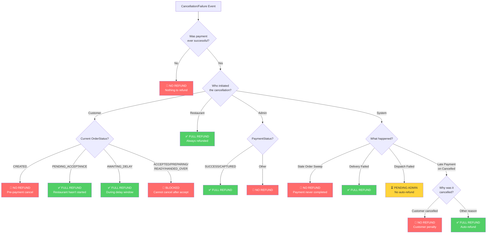
```mermaid
flowchart TD
    A[Cancellation/Failure Event] --> B{Was payment<br>ever successful?}
    B -- No --> C[🚫 NO REFUND<br>Nothing to refund]
    B -- Yes --> D{Who initiated<br>the cancellation?}
    
    D -- Customer --> E{Current OrderStatus?}
    E -- CREATED --> F[🚫 NO REFUND<br>Pre-payment cancel]
    E -- PENDING_ACCEPTANCE --> G[✅ FULL REFUND<br>Restaurant hasn't started]
    E -- AWAITING_DELAY --> H[✅ FULL REFUND<br>During delay window]
    E -- ACCEPTED/PREPARING/<br>READY/HANDED_OVER --> I[🚫 BLOCKED<br>Cannot cancel after accept]
    
    D -- Restaurant --> J[✅ FULL REFUND<br>Always refunded]
    
    D -- Admin --> K{PaymentStatus?}
    K -- SUCCESS/CAPTURED --> L[✅ FULL REFUND]
    K -- Other --> M[🚫 NO REFUND]
    
    D -- System --> N{What happened?}
    N -- Stale Order Sweep --> O[🚫 NO REFUND<br>Payment never completed]
    N -- Delivery Failed --> P[✅ FULL REFUND]
    N -- Dispatch Failed --> Q[⏳ PENDING ADMIN<br>No auto-refund]
    N -- Late Payment<br>on Cancelled --> R{Why was it<br>cancelled?}
    R -- Customer cancelled --> S[🚫 NO REFUND<br>Customer penalty]
    R -- Other reason --> T[✅ FULL REFUND<br>Auto-refund]
    
    style C fill:#ff6b6b,color:#fff
    style F fill:#ff6b6b,color:#fff
    style I fill:#ff6b6b,color:#fff
    style M fill:#ff6b6b,color:#fff
    style O fill:#ff6b6b,color:#fff
    style S fill:#ff6b6b,color:#fff
    style G fill:#51cf66,color:#fff
    style H fill:#51cf66,color:#fff
    style J fill:#51cf66,color:#fff
    style L fill:#51cf66,color:#fff
    style P fill:#51cf66,color:#fff
    style T fill:#51cf66,color:#fff
    style Q fill:#ffd43b,color:#333
```

---

## 15. End-to-End Refund Event Flow (Cross-Service)

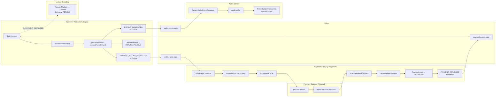
```mermaid
flowchart LR
    subgraph CustomerApp["Customer Application (Saga)"]
        A1[State Handler] --> A2[requiresRefund=true]
        A2 --> A3[processRefund / processPartialRefund]
        A3 --> A4[PAYMENT_REFUND_REQUESTED<br>to Outbox]
        A3 --> A5[REFUND_GENERATED<br>to Outbox]
        A3 --> A6[PaymentIntent →<br>REFUND_PENDING]
    end

    subgraph Kafka
        K1[order-events topic]
        K2[wallet-events topic]
        K3[payment-events topic]
    end

    subgraph PaymentService["Payment Gateway Integration"]
        P1[OrderEventConsumer] --> P2[initiateRefund via Strategy]
        P2 --> P3[Gateway API Call]
        P4[VyaparWebhookStrategy] --> P5[handleRefundSuccess]
        P5 --> P6[PaymentIntent → REFUNDED]
        P6 --> P7[PAYMENT_REFUNDED<br>to Outbox]
    end

    subgraph Gateway["Payment Gateway (External)"]
        G1[Process Refund] --> G2[refund.success Webhook]
    end

    subgraph WalletService["Wallet Service"]
        W1[GenericWalletEventConsumer] --> W2[credit wallet]
        W2 --> W3[Record WalletTransaction<br>type=REFUND]
    end

    subgraph LedgerRecording["Ledger Recording"]
        L1[Record: Platform → Customer<br>Category: REFUND]
    end

    A4 --> K1
    A5 --> K2
    K1 --> P1
    P3 --> G1
    G2 --> P4
    P7 --> K3
    K3 --> A1
    K2 --> W1
    A1 -.->|On PAYMENT_REFUNDED| L1
```

---

## 16. Refund Amount Decision Logic

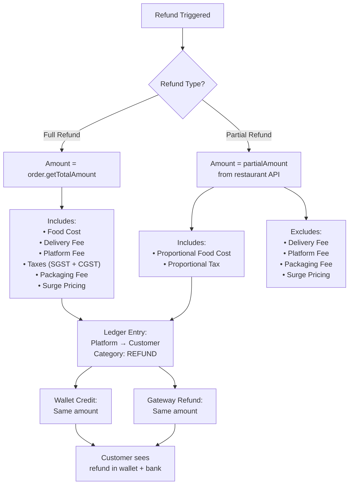
```mermaid
flowchart TD
    START[Refund Triggered] --> TYPE{Refund Type?}
    
    TYPE -- Full Refund --> FULL[Amount = order.getTotalAmount]
    FULL --> INCLUDES["Includes:<br>• Food Cost<br>• Delivery Fee<br>• Platform Fee<br>• Taxes (SGST + CGST)<br>• Packaging Fee<br>• Surge Pricing"]
    
    TYPE -- Partial Refund --> PARTIAL[Amount = partialAmount<br>from restaurant API]
    PARTIAL --> PINCLUDES["Includes:<br>• Proportional Food Cost<br>• Proportional Tax"]
    PARTIAL --> PEXCLUDES["Excludes:<br>• Delivery Fee<br>• Platform Fee<br>• Packaging Fee<br>• Surge Pricing"]
    
    INCLUDES --> LEDGER[Ledger Entry:<br>Platform → Customer<br>Category: REFUND]
    PINCLUDES --> LEDGER
    
    LEDGER --> WALLET[Wallet Credit:<br>Same amount]
    
    LEDGER --> GATEWAY[Gateway Refund:<br>Same amount]
    
    WALLET --> DONE[Customer sees<br>refund in wallet + bank]
    GATEWAY --> DONE
```

---

## 17. Refund Processing Guard Rails

This diagram shows all the safety checks that prevent invalid or duplicate refunds.

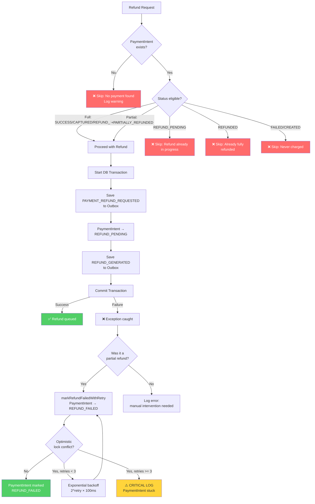
```mermaid
flowchart TD
    REQ[Refund Request] --> CHK1{PaymentIntent<br>exists?}
    CHK1 -- No --> SKIP1[❌ Skip: No payment found<br>Log warning]
    CHK1 -- Yes --> CHK2{Status eligible?}
    
    CHK2 -- Full: SUCCESS/CAPTURED/REFUND_FAILED --> PROCEED
    CHK2 -- Partial: +PARTIALLY_REFUNDED --> PROCEED
    CHK2 -- REFUND_PENDING --> SKIP2[❌ Skip: Refund already<br>in progress]
    CHK2 -- REFUNDED --> SKIP3[❌ Skip: Already fully<br>refunded]
    CHK2 -- FAILED/CREATED --> SKIP4[❌ Skip: Never charged]
    
    PROCEED[Proceed with Refund] --> TX[Start DB Transaction]
    TX --> OUTBOX[Save PAYMENT_REFUND_REQUESTED<br>to Outbox]
    OUTBOX --> STATUS[PaymentIntent →<br>REFUND_PENDING]
    STATUS --> WALLET_EVT[Save REFUND_GENERATED<br>to Outbox]
    WALLET_EVT --> COMMIT[Commit Transaction]
    
    COMMIT -- Success --> DONE[✅ Refund queued]
    COMMIT -- Failure --> FAIL[❌ Exception caught]
    FAIL --> CHK_PARTIAL{Was it a<br>partial refund?}
    CHK_PARTIAL -- Yes --> MARK_FAIL[markRefundFailedWithRetry<br>PaymentIntent → REFUND_FAILED]
    CHK_PARTIAL -- No --> LOG[Log error:<br>manual intervention needed]
    
    MARK_FAIL --> RETRY{Optimistic<br>lock conflict?}
    RETRY -- No --> DONE2[PaymentIntent marked<br>REFUND_FAILED]
    RETRY -- Yes, retries < 3 --> BACKOFF[Exponential backoff<br>2^retry × 100ms]
    BACKOFF --> MARK_FAIL
    RETRY -- Yes, retries >= 3 --> CRIT[⚠️ CRITICAL LOG<br>PaymentIntent stuck]
    
    style SKIP1 fill:#ff6b6b,color:#fff
    style SKIP2 fill:#ff6b6b,color:#fff
    style SKIP3 fill:#ff6b6b,color:#fff
    style SKIP4 fill:#ff6b6b,color:#fff
    style DONE fill:#51cf66,color:#fff
    style DONE2 fill:#51cf66,color:#fff
    style CRIT fill:#ffd43b,color:#333
```
