# Order Saga Orchestration & Event Flow

This document details the complete end-to-end lifecycle of an order within the Food Delivery system. The architecture relies on an Event-Driven Saga pattern where the `OrderSagaOrchestrator` coordinates transactions across the Payment, Restaurant, and Delivery microservices. 

It explicitly maps how events are triggered (via synchronous REST APIs vs. asynchronous Kafka messages) and details the specific Kafka topics used, along with the integration of external APIs like Maps, Communication services, WebSockets, Ledger, and the Transactional Outbox Pattern.

## Comprehensive Flow Diagram

```mermaid
sequenceDiagram
    autonumber
    
    actor Customer
    participant CA as Customer Application
    participant DB as Postgres DB & Outbox
    participant Outbox as Outbox Poller
    participant PGI as Payment Gateway
    participant K_PE as Kafka (payment-events)
    participant K_OE as Kafka (order-events)
    participant K_NE as Kafka (notification-events)
    participant CS as CommunicationIntegration
    participant RA as Restaurant Application
    participant DEA as Delivery Exec App
    participant K_LD as Kafka (logistics.dispatch)
    participant Redis as Redis (ZSET & Geo)
    participant Maps as MapsIntegration
    participant Ledger as Accounting Ledger
    actor Executive

    %% Background: Driver Location Tracking
    Note over DEA, Executive: BACKGROUND: DRIVER LOCATION TRACKING
    loop Every 5 Seconds
        Executive->>DEA: WebSocket ping (/tracking) - Lat, Lng
        DEA->>Redis: GEOADD driver_locations (Lat, Lng)
    end
    
    %% Phase 3: Menu Creation & Overrides
    Restaurant Owner->>RA: POST /api/v1/brands/{brandId}/master-menu
    RA->>DB: Save MasterMenuItem (brand_id, name, base_price, active)
    RA-->>Restaurant Owner: Return 200 OK
    Restaurant Owner->>RA: POST /api/v1/outlets/{outletId}/menu-overrides/{itemId}
    RA->>DB: Save OutletMenuOverride (price, available)
    RA-->>Restaurant Owner: Return 200 OK

    %% --------------------------------------------------------
    %% Core Scenario 1: Order Creation and Payment
    %% --------------------------------------------------------
    Customer->>CA: POST /api/v1/orders (Create Order)
    CA->>RA: GET /api/v1/restaurants/{id}/menu/batch (Fetch Menu & Prep Time)
    CA->>RA: GET /api/v1/restaurants/{id} (Fetch Location & Active Status)
    CA->>Maps: GET /api/fleet/availability/check (Check if drivers are nearby)
    Maps-->>CA: Return Available Driver Status
    CA->>CA: Validate Delivery Address is within 5km
    CA->>CA: Compute Order Total & Estimated Prep Time
    CA->>DB: Transaction: Save Order (CREATED)
    CA-->>Customer: Return Order Summary & Payment Intent (Amount)

    Customer->>PGI: POST /api/v1/payments/intent (Create Payment Intent)
    PGI->>DB: Save PaymentIntent (PENDING)
    PGI-->>Customer: Return Client Secret/Payment URL
    Customer->>PaymentGateway: Submit Payment Details (Stripe/Razorpay)
    PaymentGateway-->>Customer: Payment Success Screen

    PaymentGateway->>PGI: POST /api/v1/webhooks/{gateway} (Payment Success)
    PGI->>DB: Transaction: Save Outbox PaymentCompletedEvent
    Outbox->>K_PE: Publish PaymentCompletedEvent
    
    CA->>K_PE: Consume PaymentCompletedEvent
    CA->>DB: Transaction: Update Order Status -> PAID & Save Outbox Events
    Outbox->>DB: Query UNPROCESSED Outbox Events
    Outbox->>K_NE: Publish NotificationRequestEvent (ORDER_PAID)
    Outbox->>K_OE: Publish OrderPaidEvent (includes estimatedPrepTime, deliveryLat, deliveryLng)
    CS->>K_NE: Consume Event
    CS-->>Customer: Push Notification: Order Paid (via SES/Twilio)
    
    %% Scenario 2: Restaurant Acceptance and Delay Negotiation
    Note over Customer, Executive: SCENARIO: RESTAURANT ACCEPTANCE & DELAY NEGOTIATION
    
    RA->>K_OE: Consume OrderPaidEvent
    RA->>DB: Save RestaurantOrder (PENDING)
    
    Restaurant Staff->>RA: POST /api/v1/restaurants/{restaurantId}/fulfillment/orders/{orderId}/accept
    
    alt Prep Time <= 10 mins extra (or null)
        RA->>RA: Update Order (ACCEPTED) & Start Preparation
        RA->>K_OE: Publish OrderAcceptedEvent (includes deliveryLat, deliveryLng)
    else Prep Time > 10 mins extra
        RA->>K_OE: Publish OrderDelayApprovalRequestedEvent
        CA->>K_OE: Consume Event
        CA->>DB: Transaction: Update DB (AWAITING_DELAY_APPROVAL) & Save Outbox
        Outbox->>K_NE: Publish NotificationRequestEvent
        CS->>K_NE: Consume Event
        CS-->>Customer: Push Notification: Delay approval needed
        
        alt Customer Approves
            Customer->>CA: POST /api/v1/orders/{orderId}/delay-approval (true)
            CA->>DB: Transaction: Save Outbox (OrderDelayApprovedEvent)
            Outbox->>K_OE: Publish OrderDelayApprovedEvent
            RA->>K_OE: Consume Approved Event
            RA->>RA: Accept Order & Start Preparation
            RA->>K_OE: Publish OrderAcceptedEvent (includes deliveryLat, deliveryLng)
        else Customer Rejects
            Customer->>CA: POST /api/v1/orders/{orderId}/delay-approval (false)
            CA->>DB: Transaction: Update DB (CANCELLED) & Save Outbox
            Outbox->>K_OE: Publish OrderDelayRejectedEvent
            Outbox->>K_NE: Publish NotificationRequestEvent
            RA->>K_OE: Consume OrderDelayRejectedEvent (Stop Preparation)
            DEA->>K_OE: Consume OrderDelayRejectedEvent (Abort Dispatch / Release Driver)
            CS-->>Customer: Push Notification: Order Cancelled & Refunded
            CA->>PGI: Initiate Refund (REST/API)
        else Customer ignores (10 min Timeout)
            CA->>CA: Scheduled Poller detects 10 min timeout
            CA->>DB: Transaction: Update DB (CANCELLED) & Save Outbox
            Outbox->>K_OE: Publish OrderDelayRejectedEvent (Auto)
            Outbox->>K_NE: Publish NotificationRequestEvent
            RA->>K_OE: Consume OrderDelayRejectedEvent (Stop Preparation)
            DEA->>K_OE: Consume OrderDelayRejectedEvent (Abort Dispatch / Release Driver)
            CS-->>Customer: Push Notification: Order Auto-cancelled
            CA->>PGI: Initiate Refund (REST/API)
        end
    end
    
    %% Scenario 2.5: Restaurant Cancels After Accept
    Note over Customer, Executive: SCENARIO: RESTAURANT CANCELS ORDER
    RA->>K_OE: Publish OrderCancelledByRestaurantEvent
    CA->>K_OE: Consume Event
    CA->>DB: Update DB (CANCELLED_BY_RESTAURANT) & Save Outbox Notification
    Outbox->>K_NE: Publish NotificationRequestEvent
    CS-->>Customer: Push Notification: Order Cancelled By Restaurant
    CA->>PGI: Initiate Refund (REST/API)
    DEA->>K_OE: Consume Event
    DEA->>Redis: ZREM delayed_dispatch_queue (Abort phantom dispatch)
    
    %% Scenario 3: Delayed Delivery Dispatch (MapsIntegration & Fleet Tracking)
    Note over Customer, Executive: SCENARIO: DELAYED DELIVERY DISPATCH
    
    DEA->>K_OE: Consume OrderAcceptedEvent (includes deliveryLat, deliveryLng)
    DEA->>DEA: Calculate dispatchTime = (Now + PrepTime) - 15 mins
    DEA->>Redis: ZADD delayed_dispatch_queue dispatchTime orderId
    
    loop Every 1 Minute (DelayedDispatchPoller)
        DEA->>Redis: ZRANGEBYSCORE delayed_dispatch_queue 0 Now
        Redis-->>DEA: Returns orders ready for dispatch
        DEA->>Redis: ZREM delayed_dispatch_queue (remove processed orders)
        DEA->>K_LD: Publish Dispatch Request (includes deliveryLat, deliveryLng)
        
        Maps->>K_LD: Consume Dispatch Request
        Maps->>Redis: GEORADIUS driver_locations (Find nearby available)
        Maps->>Maps: Request Route/Distance Matrix (Ola/Google/Mapbox)
        Maps->>Maps: Sort & Atomically Lock best Driver (Redis)
        
        alt Driver Found
            Maps->>K_OE: Publish DISPATCH_CANDIDATE_FOUND (includes delivery destination)
            DEA->>K_OE: Consume DISPATCH_CANDIDATE_FOUND
            DEA->>Executive: Push Notification to Driver App
            
            %% Driver Interaction
            alt Executive Accepts
                Executive->>DEA: POST /api/delivery/drivers/{driverId}/orders/{orderId}/accept
                DEA->>Redis: Acquire Lock (order:driver:lock:{orderId})
                DEA->>K_OE: Publish DRIVER_ASSIGNED
                CA->>K_OE: Consume DRIVER_ASSIGNED
                CA->>DB: Update DB (DISPATCHED) & Save Outbox Notification
                CS-->>Customer: Push Notification: Driver Assigned
            else Executive Rejects or Timeouts
                Executive->>DEA: POST /api/delivery/drivers/{driverId}/orders/{orderId}/reject
                DEA->>DEA: Release Driver Lock (REST to MapsIntegration)
                DEA->>K_OE: Publish ORDER_DRIVER_REJECTED
                DEA->>K_OE: Consume ORDER_DRIVER_REJECTED (Self-consume)
                DEA->>K_LD: Publish Dispatch Request (Retry next driver)
            end
        else No Driver Found
            Maps->>K_OE: Publish DISPATCH_FAILED
            CA->>K_OE: Consume DISPATCH_FAILED
            CA->>DB: Transaction: Update DB (DELIVERY_FAILED) & Refund
            Outbox->>K_NE: Publish NotificationRequestEvent
            CS-->>Customer: Push Notification: Order Refunded due to no drivers
        end
    end
    
    %% Scenario 4: Food Ready & Pickup
    Note over Customer, Executive: SCENARIO: FOOD READY & DELIVERY
    
    Restaurant Staff->>RA: POST /api/v1/restaurants/{restaurantId}/fulfillment/orders/{orderId}/ready
    RA->>K_OE: Publish ORDER_READY
    CA->>K_OE: Consume ORDER_READY
    CA->>DB: Transaction: Update DB (READY_FOR_PICKUP) & Save Outbox
    Outbox->>K_NE: Publish NotificationRequestEvent
    CS-->>Customer: Push Notification: Food Ready
    
    Executive->>DEA: POST /api/delivery/drivers/{driverId}/orders/{orderId}/status (PICKED_UP)
    DEA->>K_OE: Publish OrderPickedUpEvent
    CA->>K_OE: Consume OrderPickedUpEvent
    CA->>DB: Transaction: Update DB (OUT_FOR_DELIVERY) & Save Outbox
    Outbox->>K_NE: Publish NotificationRequestEvent
    CS-->>Customer: Push Notification: Order Picked Up
    
    Executive->>DEA: POST /api/delivery/drivers/{driverId}/orders/{orderId}/status (DELIVERED)
    DEA->>K_OE: Publish OrderDeliveredEvent
    CA->>K_OE: Consume OrderDeliveredEvent
    CA->>DB: Transaction: Update DB (DELIVERED) & Save Outbox
    CA->>Ledger: DoubleEntryLedgerService: Split funds (Restaurant 80%, Driver Flat)
    Outbox->>K_NE: Publish NotificationRequestEvent
    CS-->>Customer: Push Notification: Order Delivered
```

## Detailed Explanations

### 1. The Transactional Outbox Pattern (Critical Reliability Component)
To prevent split-brain scenarios where the Database is updated but the Kafka message fails to send (or vice-versa), the `CustomerApplication` employs the **Transactional Outbox Pattern**:
1. When a state changes (e.g., `ORDER_PAID`), the `OrderSagaOrchestrator` updates the `orders` table AND inserts a row into the `outbox_events` table (status: `UNPROCESSED`) within the **same PostgreSQL ACID transaction**.
2. A separate background worker (`OutboxEventPoller`) runs continuously, querying the `outbox_events` table.
3. It securely publishes the event to the appropriate Kafka Topic (`order-events` or `notification-events`) and then marks the outbox row as `PROCESSED`. This guarantees "at-least-once" delivery even if the service crashes mid-transaction.

### 2. Live Tracking & The MapsIntegration Microservice
Finding the best driver requires matching real-world coordinates, which is handled entirely by the dedicated `MapsIntegration` microservice:
1. **Real-time WebSockets**: Delivery Executives maintain a persistent WebSocket connection (`LocationTrackingWebSocketHandler`) with the `DeliveryExecutiveApplication`. It continually blasts their current GPS coordinates (Latitude/Longitude), which are instantly inserted into a Redis Geo-Spatial Index (`driver_locations`).
2. **Rough Filtering & Precision Sorting (Maps API)**: The `MapsIntegration` service consumes dispatch requests, fetches executives within a 5km radial boundary using `GEORADIUS`, and then calls an external Maps API (Ola Maps, Google Maps, Mapbox) to calculate actual road distance and traffic-adjusted ETA. 
3. **Atomic Driver Locking**: The best driver is locked in Redis by MapsIntegration using a distributed lock to prevent them from being assigned two orders simultaneously. Additionally, when a driver accepts an order in `DeliveryExecutiveApplication`, a second Redis lock (`order:driver:lock:{orderId}`) ensures only one driver can claim the order ping concurrently.
4. **Fallback & Failures**: If the driver rejects the order (`ORDER_DRIVER_REJECTED`), `DeliveryExecutiveApplication` releases the Redis lock and triggers a retry to `MapsIntegration`. If `MapsIntegration` cannot find any drivers, it publishes `DISPATCH_FAILED`, which automatically refunds the customer.

### 3. Kafka Topics & Events
- `payment-events`:
  - `PaymentCompletedEvent`: Signals successful payment from PaymentGatewayIntegration.
  - `PaymentFailedEvent`: Signals a failed transaction (e.g., failed webhook from gateway). Refunds correctly handle API failures gracefully to avoid poison pill retries by transitioning the intent to `REFUND_FAILED`.
- `order-events`:
  - `OrderPaidEvent`: Triggers restaurant fulfillment logic and forwards `deliveryLat`/`deliveryLng`.
  - `OrderAcceptedEvent`: Triggers the delivery dispatch timer, propagating delivery coordinates.
  - `OrderDelayApprovalRequestedEvent` / `OrderDelayApprovedEvent` / `OrderDelayRejectedEvent`: Manages the dynamic prep time negotiation.
  - `DRIVER_ASSIGNED`: Signals the order is successfully assigned.
  - `ORDER_DRIVER_REJECTED`: Signals the driver rejected the ping.
  - `DISPATCH_FAILED`: Signals no drivers are available (triggers refund).
  - `OrderPickedUpEvent` / `OrderDeliveredEvent`: Routing terminal states.
  - `OrderRejectedEvent` / `ORDER_CANCELLED_BY_RESTAURANT`: Published by `RestaurantApplication` if they cannot fulfill the order. Aborts pending dispatches in `DeliveryExecutiveApplication`.
- `notification-events`:
  - `NotificationRequestEvent`: Polled from the Outbox and consumed by the `CommunicationIntegration` service to send Push/SMS/Email notifications to customers or drivers.
- `platform.logistics.dispatch`:
  - Consumed by `MapsIntegration` to trigger the fleet assignment logic.

### 4. Financial Reconciliation (Double-Entry Ledger)
When the delivery is successful and `ORDER_DELIVERED` is processed, the `DoubleEntryLedgerService` strictly accounts for the flow of money. It performs ACID-compliant internal ledger transfers from the "Platform Account":
- **Restaurant Payout**: Typically 80% of the `totalAmount`.
- **Driver Payout**: A flat delivery fee.
- **Platform Revenue**: The remainder kept as margin.
These explicit Ledger transfers ensure that all financial settlements are fully auditable and prevent leaked funds.

### 5. CommunicationIntegration Microservice
The system abstracts away external communication providers (AWS SES, Twilio, Firebase) via the `CommunicationIntegration` service. It dynamically routes `NotificationRequestEvent` messages to the correct channel and logs every outbound message to `notification_db` for compliance and auditing.

### 6. State Transition Integrity
The `OrderSagaOrchestrator` enforces strict forward-only state transitions based on the ordinal values of the `OrderStatus` enum. Any attempt to regress the order state (e.g. from `DELIVERED` back to `DISPATCHED`, or `PAID` back to `CREATED`) is actively blocked, logging a `BACKWARD_STATE_TRANSITION_ATTEMPT` error. This guarantees state machine immutability and protects downstream idempotent operations like ledger transfers and notification dispatches.

### 7. Hierarchical Restaurant Data Model (3-Phase Registration)
The system utilizes a 3-phase hierarchical registration model for restaurants:
1. **Brand Onboarding**: Creating the corporate entity (GSTIN, PAN, Bank Details).
2. **Outlet Onboarding**: Creating physical storefronts under a Brand (Location, FSSAI, Operating Hours).
3. **Menu Setup**: Brands define a global `MasterMenu`, while Outlets can override prices or availability via `OutletMenuOverride`.

*Note: For the purpose of the Order Saga and backwards compatibility, any reference to `restaurantId` or the `/api/v1/restaurants/{id}` endpoint in the Customer Application maps directly to a specific physical **Outlet** ID.*
