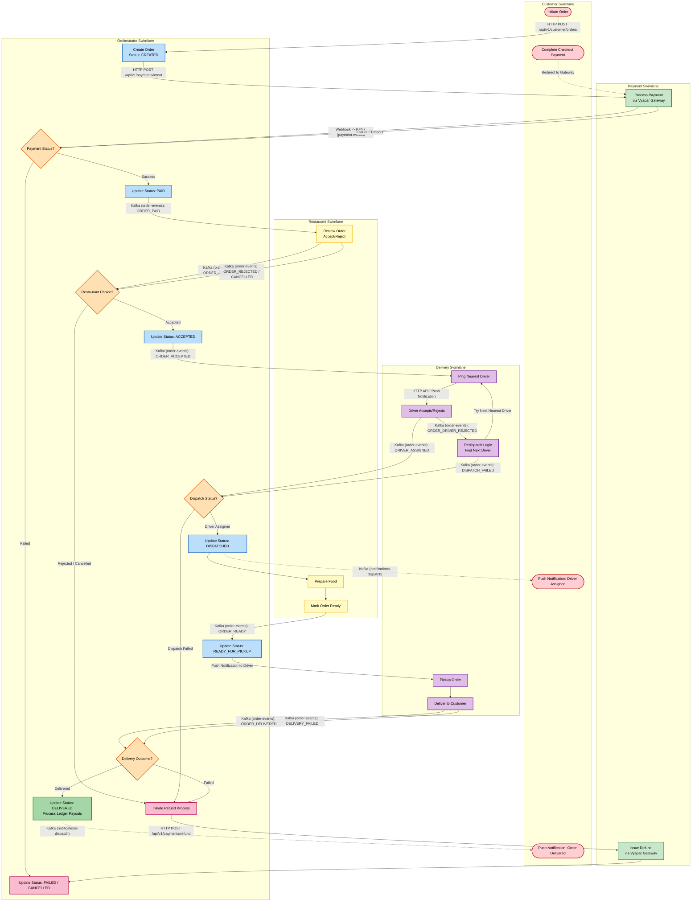

# Order Saga Orchestration Flow

This document details the complete end-to-end lifecycle of an order within the Food Delivery system. The architecture relies on an Event-Driven Saga pattern where the `OrderSagaOrchestrator` coordinates transactions across the Payment, Restaurant, and Delivery microservices. 

The diagram below maps every action to its corresponding system actor, outlining all happy paths and edge cases (such as payment failures, restaurant rejections, and dispatch timeouts).

## Architecture Swimlane Flowchart

## Scenario Breakdown & Edge Cases

The following details all scenarios handled by the `OrderSagaOrchestrator` through the Kafka event streams.

### 1. Payment Phase
- **Happy Path:** The external payment gateway successfully captures the funds. `PaymentSucceededEvent` is published to the `payment-events` topic. Orchestrator updates order to `PAID` and emits `ORDER_PAID`.
- **Edge Case (Payment Failure/Timeout):** The order stays in `CREATED` or moves directly to a failed state. The Saga does not proceed to the restaurant.
- **Edge Case (Duplicate Payment Events):** If the payment gateway fires duplicate webhooks, the orchestrator detects the order is already in `PAID` state and ignores the duplicate to maintain idempotency.

### 2. Restaurant Acceptance Phase
- **Happy Path:** Restaurant receives `ORDER_PAID`. The staff reviews and accepts the order. Emits `ORDER_ACCEPTED`. Orchestrator updates status to `ACCEPTED`.
- **Edge Case (Restaurant Rejects):** Staff emits `ORDER_REJECTED` or `ORDER_CANCELLED_BY_RESTAURANT`. Orchestrator catches this, immediately sets order to `DELIVERY_FAILED` and invokes the Refund process via `PaymentGatewayIntegration`.
- **Edge Case (Restaurant Timeout):** If the restaurant doesn't accept in a configured time window (configurable via a scheduler), a timeout event is fired causing automatic rejection and refund.

### 3. Driver Dispatch Phase
- **Happy Path:** Following `ORDER_ACCEPTED`, the `DeliveryExecutiveApplication` queries `MapsIntegration` to find the closest driver and pings them. The driver accepts, emitting `DRIVER_ASSIGNED`. Orchestrator updates to `DISPATCHED` and notifies the customer via `NotificationService`.
- **Edge Case (Driver Rejects Ping):** Driver declines or lets the ping timeout. Emits `ORDER_DRIVER_REJECTED`. The Orchestrator ignores this event, as the `DeliveryExecutiveApplication` internally handles redispatch logic to find the *next* closest driver.
- **Edge Case (Total Dispatch Failure):** The system exhausts all nearby drivers, or no drivers are online. Emits `DISPATCH_FAILED`. Orchestrator catches this, updates status to `DELIVERY_FAILED`, and processes a full refund to the customer.

### 4. Preparation & Delivery Phase
- **Happy Path:** Restaurant staff finishes the food and emits `ORDER_READY`. Orchestrator updates status to `READY_FOR_PICKUP`. Driver picks it up, drives to the customer, and emits `ORDER_DELIVERED`. 
- **Ledger Settlement:** On `ORDER_DELIVERED`, the Orchestrator calculates the financial splits (e.g., 80% to Restaurant, 20% to Platform, flat rate to Driver) and records the double-entry accounting transactions in the `LedgerService`. A final push notification is sent to the customer.
- **Edge Case (Delivery Fails in Transit):** If the driver gets into an accident or cannot find the customer, they emit `DELIVERY_FAILED` (via generic `ORDER_STATUS_UPDATED` event). Orchestrator catches this, logs the failure, and issues a Refund.

### 5. Automated Refund Engine
> [!WARNING]
> The orchestrator implements a unified `processRefund()` mechanism to prevent phantom charges. Any edge case that breaks the Saga chain after payment capture (Restaurant Rejects, Dispatch Fails, Delivery Fails) funnels into this engine.

The engine directly queries the `PaymentGatewayIntegration` REST API using the original `gatewayOrderId`. If the refund REST call fails (e.g., due to network partition), the system logs an error but relies on external reconciliation or retry mechanisms to eventually process the refund, ensuring the double-entry ledger reverse transactions are only recorded upon successful HTTP 2xx confirmation from Vyapar.
