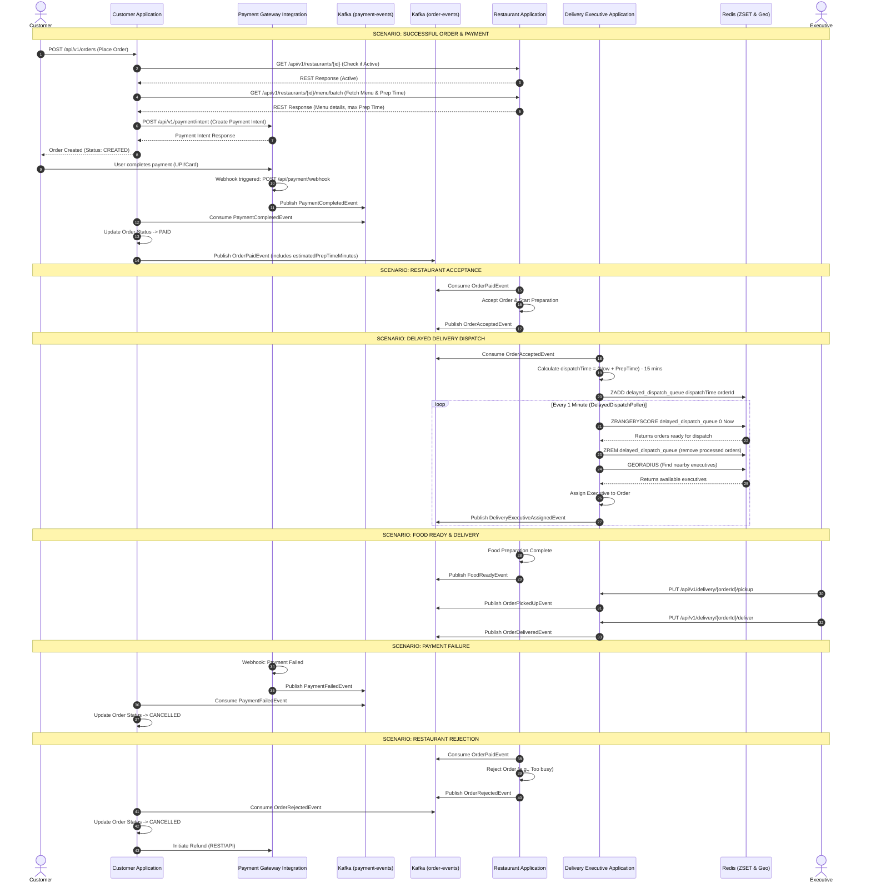

# Order Saga Orchestration & Event Flow

This document details the complete end-to-end lifecycle of an order within the Food Delivery system. The architecture relies on an Event-Driven Saga pattern where the `OrderSagaOrchestrator` coordinates transactions across the Payment, Restaurant, and Delivery microservices. 

It explicitly maps how events are triggered (via synchronous REST APIs vs. asynchronous Kafka messages) and details the specific Kafka topics used. It also covers the delayed dispatch edge case using Redis ZSETs.

## Comprehensive Flow Diagram

## Detailed Explanations

### 1. Synchronous vs Asynchronous Triggers
- **Synchronous (REST APIs)**: Used when immediate responses are required for the user or between systems.
  - Creating an order (`POST /api/v1/orders`)
  - Validating Restaurant & Menu during order creation (`GET /api/v1/restaurants...`)
  - Initiating Payment Intents (`POST /api/v1/payment/intent`)
  - Executive updating status to picked up / delivered (`PUT /api/v1/delivery/...`)
- **Asynchronous (Kafka & Redis)**: Used for eventual consistency, cross-service workflows, and temporal operations.
  - Order state transitions (`order-events`)
  - Payment status updates (`payment-events`)
  - Delayed dispatching based on preparation time (Redis Scheduled Poller)

### 2. Kafka Topics & Events
- `payment-events`:
  - `PaymentCompletedEvent`: Triggered by payment gateway webhook. Consumed by `CustomerApplication` to transition order to `PAID`.
  - `PaymentFailedEvent`: Consumed by `CustomerApplication` to transition order to `CANCELLED`.
- `order-events`:
  - `OrderPaidEvent`: Published by `CustomerApplication`. Consumed by `RestaurantApplication` to begin food preparation.
  - `OrderAcceptedEvent`: Published by `RestaurantApplication`. Consumed by `DeliveryExecutiveApplication` to schedule delivery dispatch.
  - `DeliveryExecutiveAssignedEvent`: Published by `DeliveryExecutiveApplication`.
  - `FoodReadyEvent`: Published by `RestaurantApplication` when cooking is complete.
  - `OrderPickedUpEvent` & `OrderDeliveredEvent`: Published by `DeliveryExecutiveApplication` when the driver updates their app.
  - `OrderRejectedEvent`: Published by `RestaurantApplication` if they cannot fulfill the order.

### 3. The "Just-In-Time" Dispatch Mechanism (Redis ZSET)
Why wait until 15 minutes before the food is ready? 
- If a delivery partner arrives too early, they waste time waiting at the restaurant. 
- If we assign them immediately for a 45-minute preparation, they are blocked from taking other deliveries.

**Implementation**:
1. When `DeliveryExecutiveApplication` consumes `OrderAcceptedEvent`, it does not immediately assign a driver.
2. It calculates `dispatchTime = (CurrentTime + estimatedPrepTimeMinutes) - 15 minutes`.
3. It stores the `orderId` in a Redis Sorted Set (`ZSET`) called `delayed_dispatch_queue` with the `dispatchTime` (Unix timestamp) as the score.
4. A `@Scheduled` background worker (`DelayedDispatchPoller`) runs every 60 seconds, querying Redis using `ZRANGEBYSCORE 0 {currentTime}` to find orders that are due for dispatch.
5. It then uses Redis Geospatial queries to find the nearest available executive and assigns the order.
