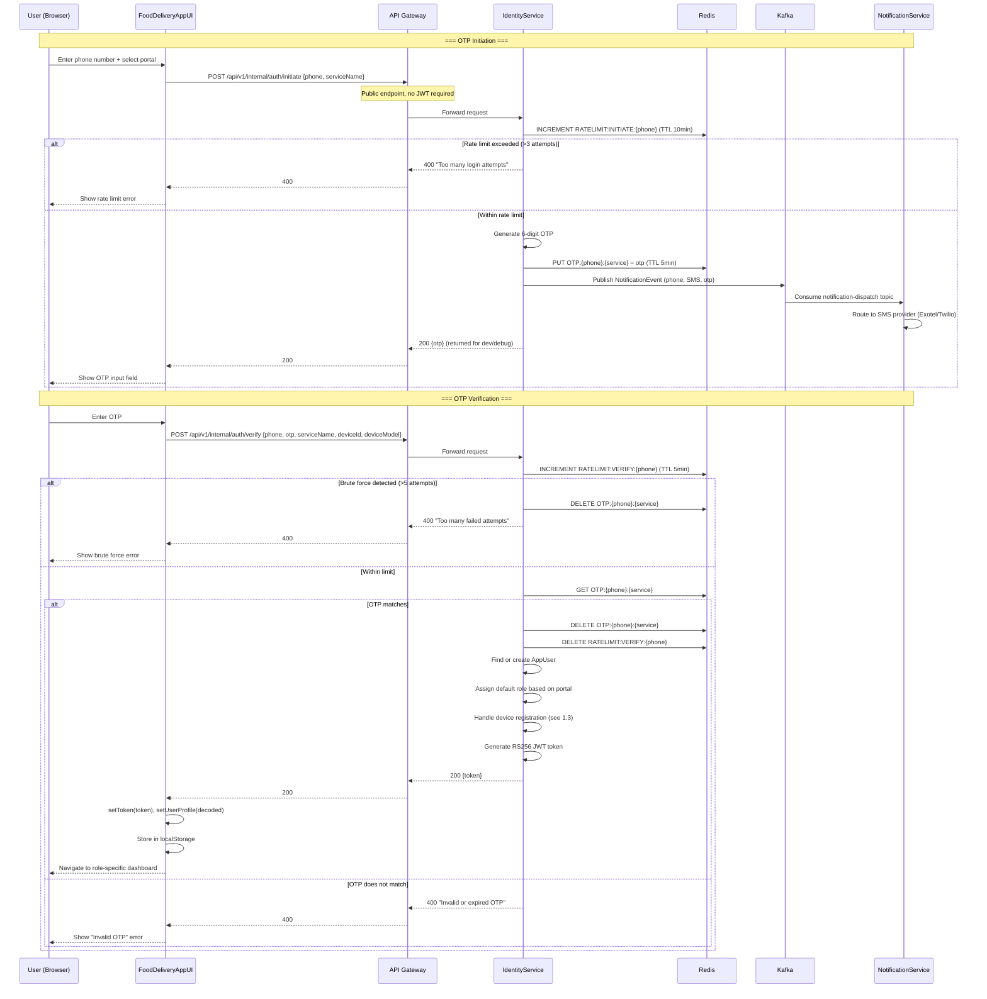
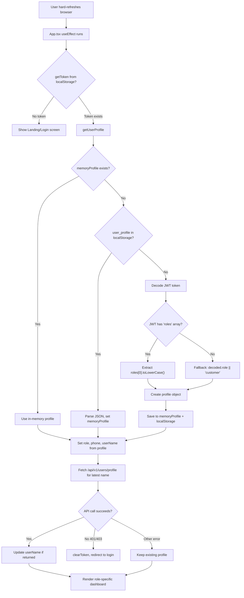
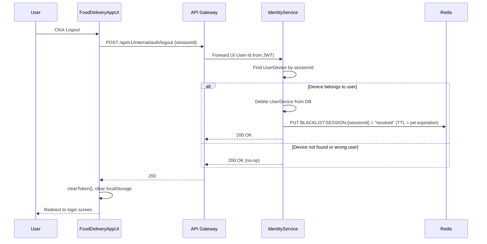
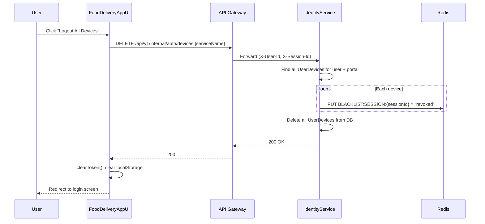
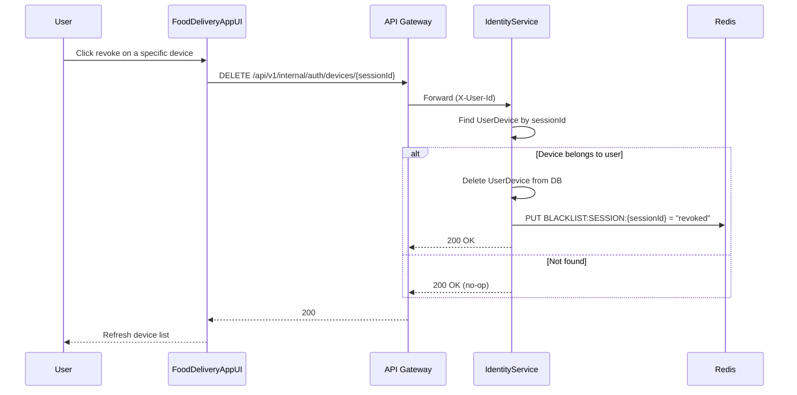
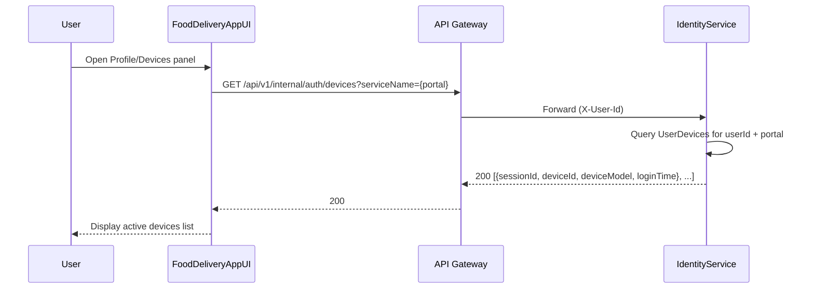
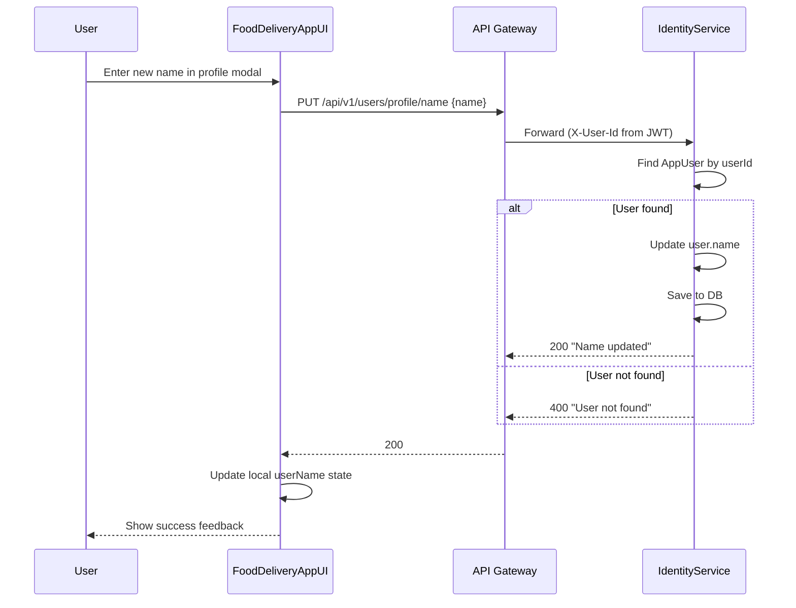
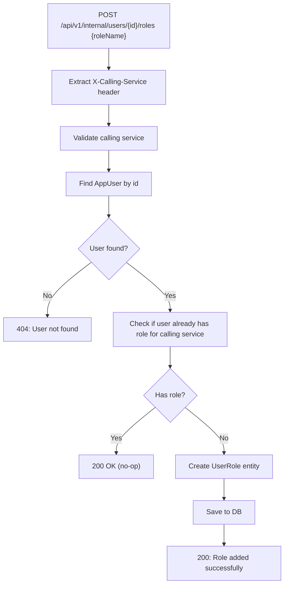

# 1. Authentication Flows

## 1.1 Login (OTP Initiation + Verification)



## 1.2 Hard Refresh / Session Restoration



## 1.3 Device Management (Max 2 Devices)

```mermaid
flowchart TD
    A[User verifies OTP successfully] --> B{Same deviceId already registered?}
    B -- Yes --> C[Revoke existing session for that device]
    C --> D[Remove old UserDevice from DB]
    D --> E[BLACKLIST:SESSION:{oldSessionId} in Redis]
    E --> F{Active devices >= 2?}
    B -- No --> F
    F -- Yes --> G[Evict oldest device]
    G --> H[Remove oldest UserDevice from DB]
    H --> I[BLACKLIST:SESSION:{oldestSessionId} in Redis]
    I --> J[Save new UserDevice]
    F -- No --> J
    J --> K[Generate JWT with new sessionId]
    K --> L[Return JWT token]
```

## 1.4 Logout (Single Device)



## 1.5 Logout All Devices



## 1.6 Revoke Specific Device



## 1.7 View Active Devices



## 1.8 Profile Update (Name)



## 1.9 Internal Role Management (Service-to-Service)


