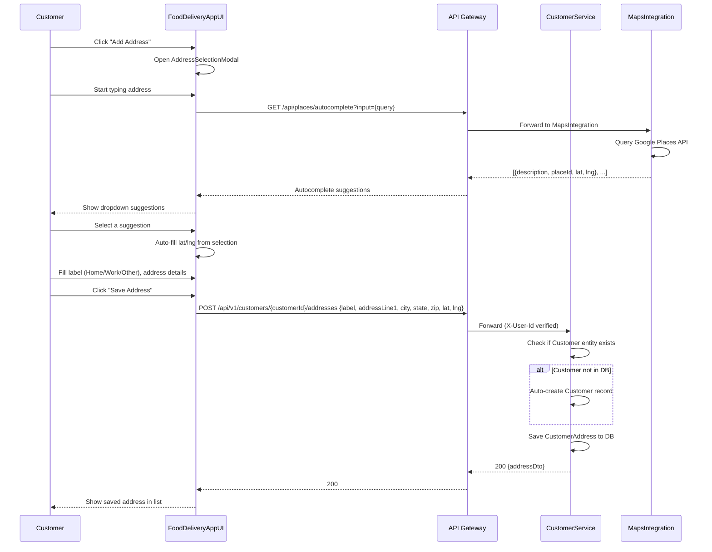
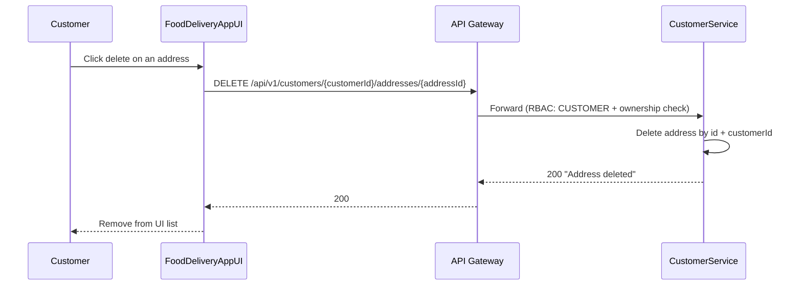
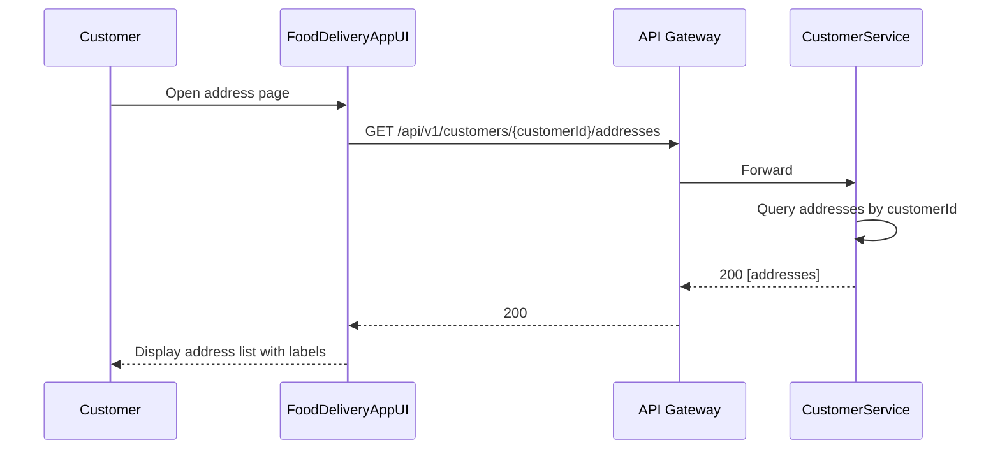
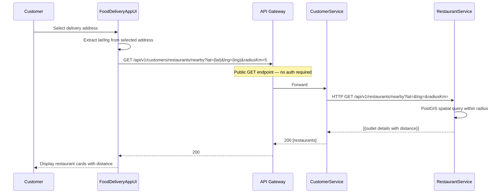
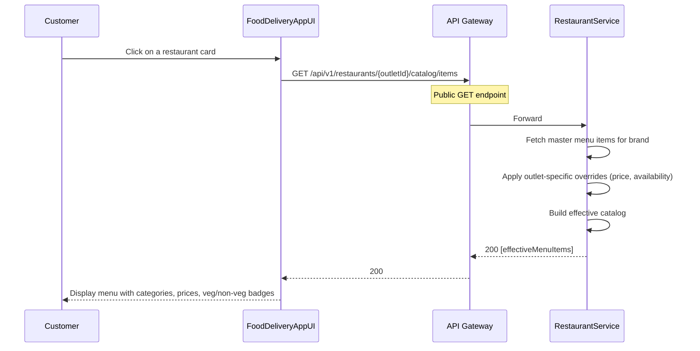
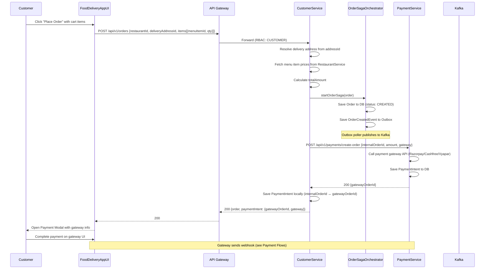
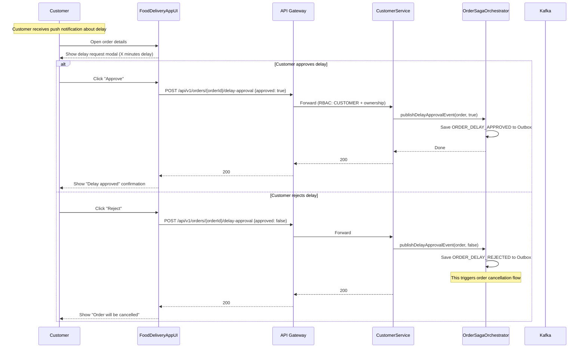
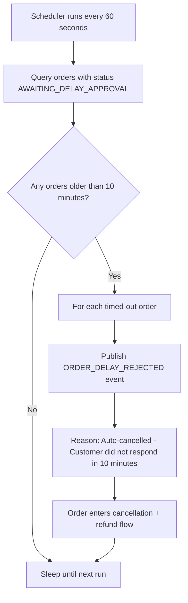
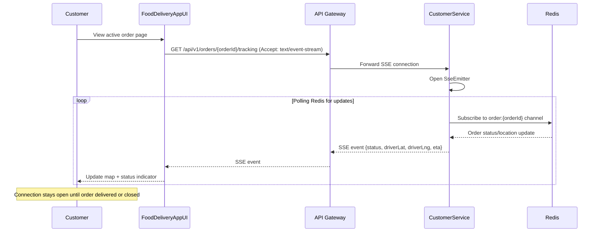
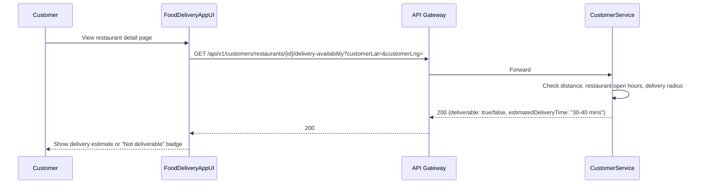

# 2. Customer Flows

## 2.1 Address Management — Add Address



## 2.2 Address Management — Delete Address



## 2.3 Address Management — List Addresses



## 2.4 Restaurant Discovery — Browse Nearby



## 2.5 Restaurant Discovery — View Menu (Effective Catalog)



## 2.6 Cart Management

```mermaid
flowchart TD
    A[Customer views restaurant menu] --> B{Add item to cart?}
    B -- Yes --> C[UI: Add item to local cart state]
    C --> D[Show cart drawer with items]
    D --> E{Modify quantity?}
    E -- Increase --> F[Increment item quantity]
    E -- Decrease --> G{Quantity > 1?}
    G -- Yes --> H[Decrement quantity]
    G -- No --> I[Remove item from cart]
    E -- No changes --> J{Ready to order?}
    F --> J
    H --> J
    I --> J
    B -- No --> J
    J -- Yes --> K[Click "Place Order"]
    J -- No --> L[Continue browsing]
    K --> M{Delivery address selected?}
    M -- No --> N[Prompt to select address]
    N --> O[Open AddressSelectionModal]
    O --> M
    M -- Yes --> P[Proceed to create order]
```

## 2.7 Place Order (Full Flow)



## 2.8 Delay Approval (Customer Responds to Restaurant Delay Request)



## 2.9 Delay Approval Timeout (Auto-Cancel)



## 2.10 Live Order Tracking (SSE)



## 2.11 Delivery Availability Check


