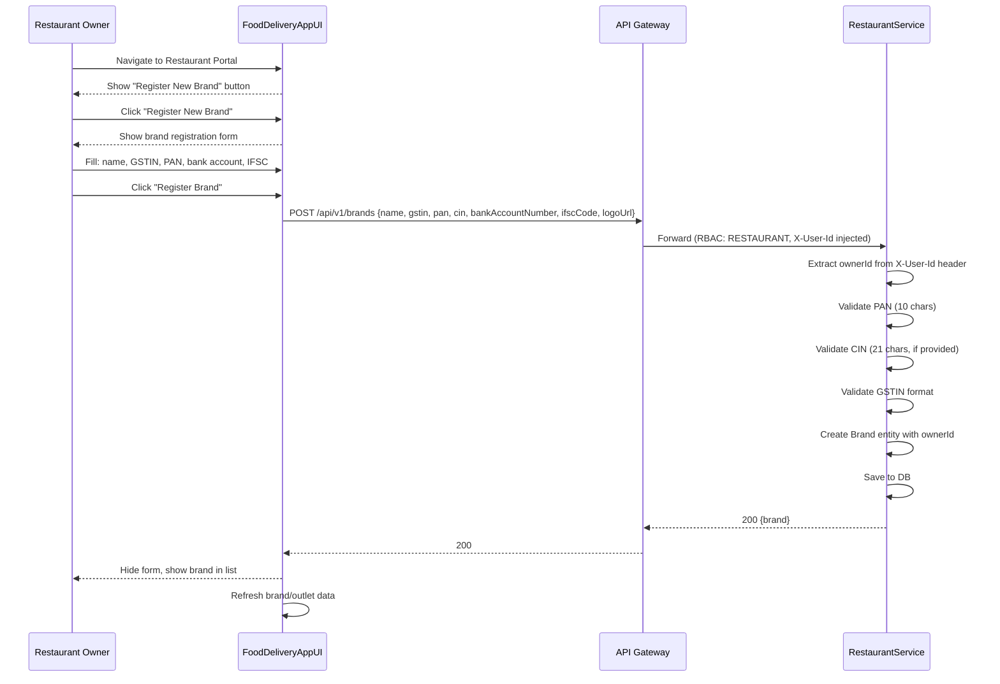
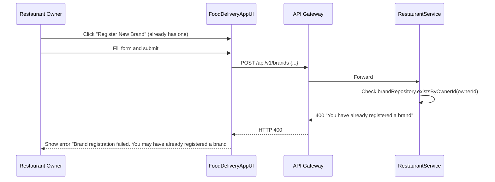
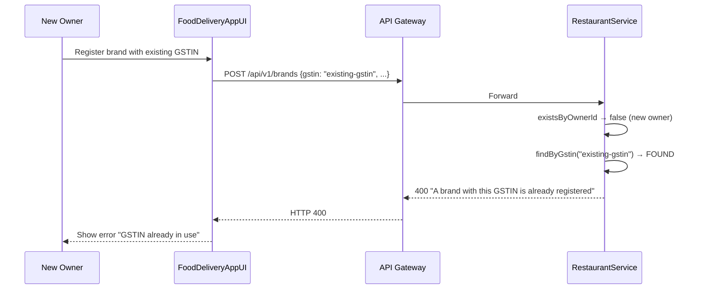
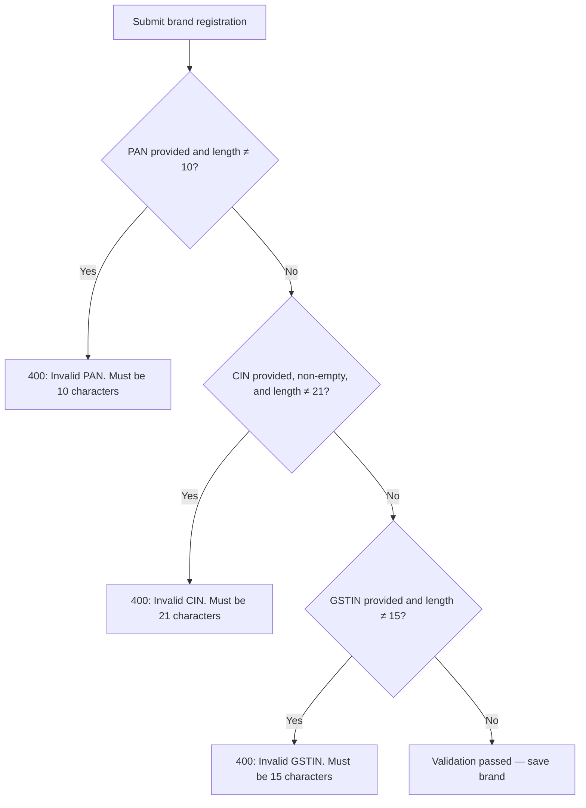
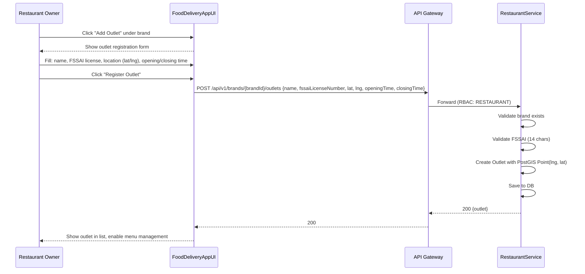
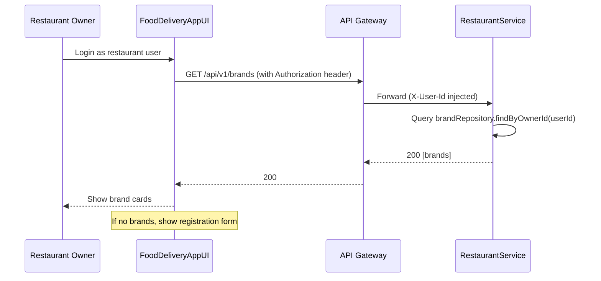
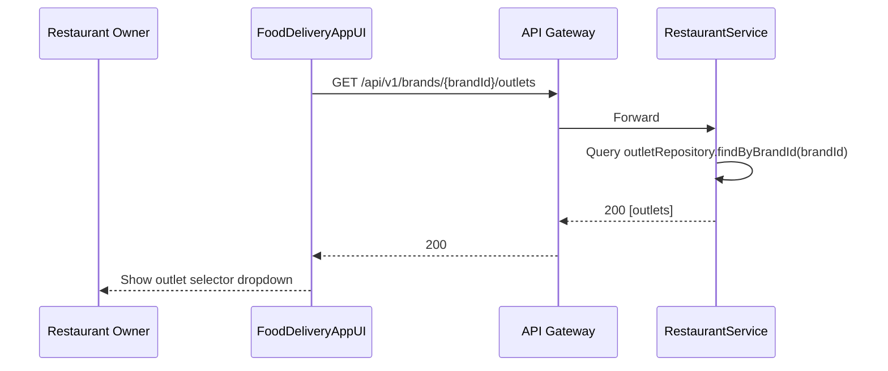
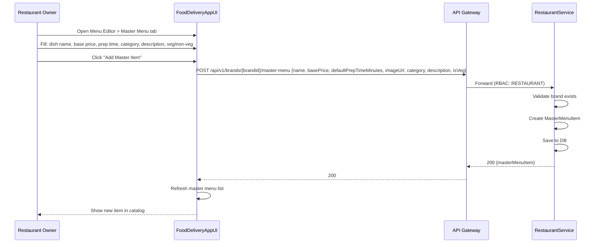
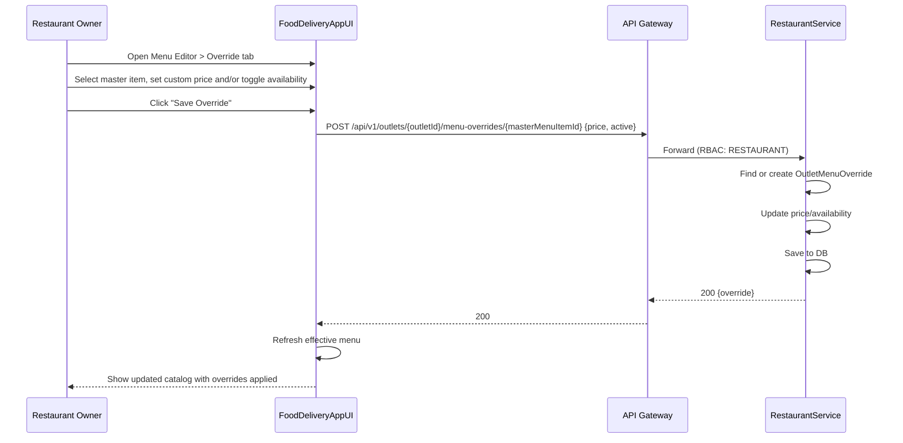
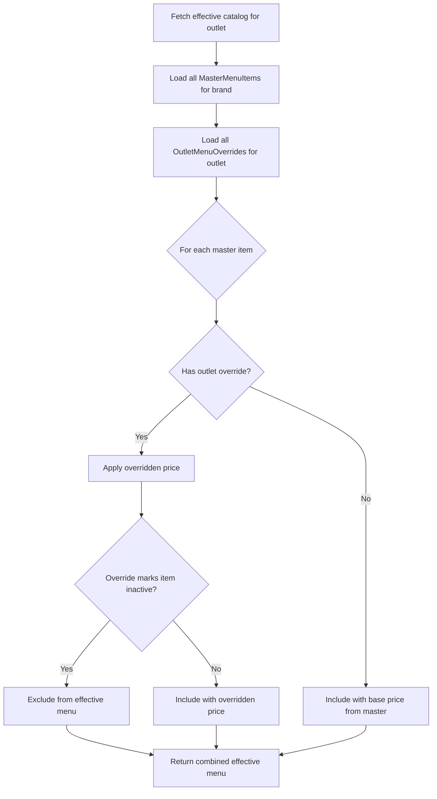

# 3. Restaurant Onboarding Flows

## 3.1 Brand Registration (Happy Path)

## 3.2 Duplicate Brand Prevention — Same Owner

## 3.3 Duplicate Brand Prevention — Same GSTIN

## 3.4 Brand Registration Validation Failures

## 3.5 Outlet Registration

## 3.6 View Brands for Logged-In Owner

## 3.7 View Outlets for a Brand

## 3.8 Master Menu Item Creation

## 3.9 Outlet Menu Override

## 3.10 View Effective Menu (What Customers See)

