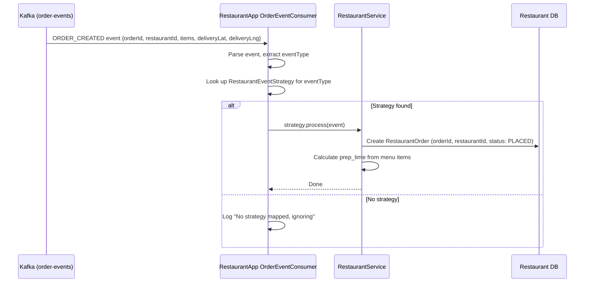
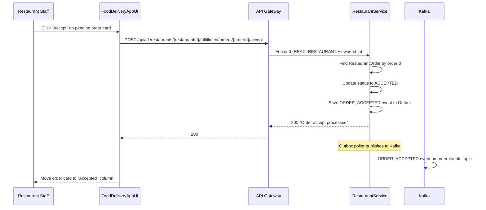
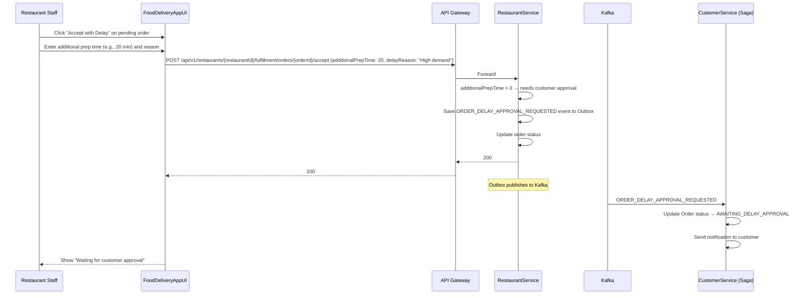
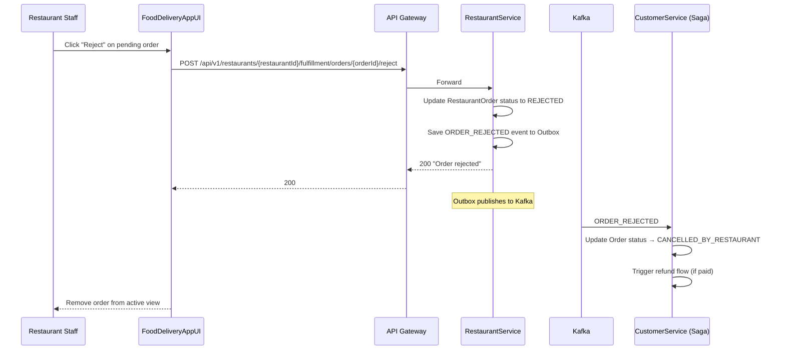
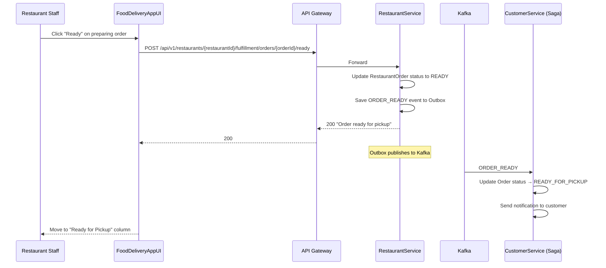
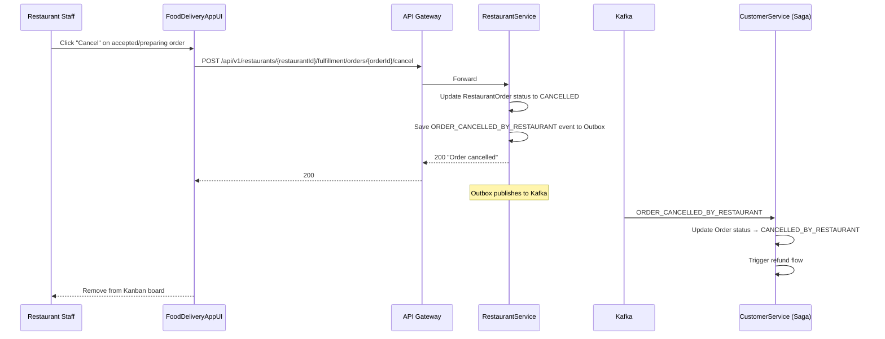
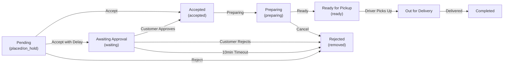

# 4. Restaurant Fulfillment Flows

## 4.1 Order Arrives at Restaurant (Kafka Consumer)



## 4.2 Accept Order (No Delay)



## 4.3 Accept Order With Delay (Delay Approval Request)



## 4.4 Reject Order



## 4.5 Mark Order Ready for Pickup



## 4.6 Cancel Order After Acceptance



## 4.7 Toggle Store Online/Offline

```mermaid
flowchart TD
    A[Restaurant staff clicks toggle] --> B{Currently accepting orders?}
    B -- Yes --> C[Set store to OFFLINE]
    C --> D[UI shows red status indicator]
    D --> E[New orders will not be routed to this outlet]
    B -- No --> F[Set store to ONLINE]
    F --> G[UI shows green pulsing indicator]
    G --> H[Store is now visible for customer orders]
    Note over A: This is currently UI-only state, not persisted to backend
```

## 4.8 Kitchen Kanban Board Flow


