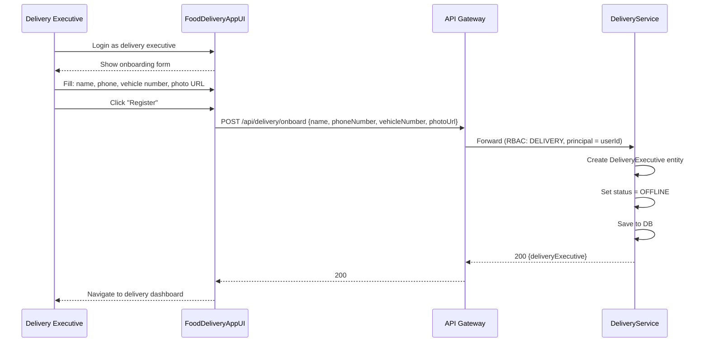
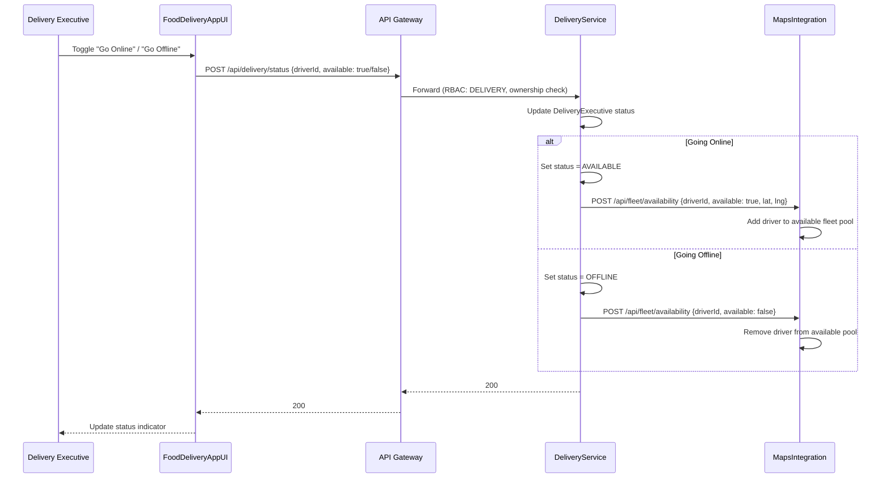
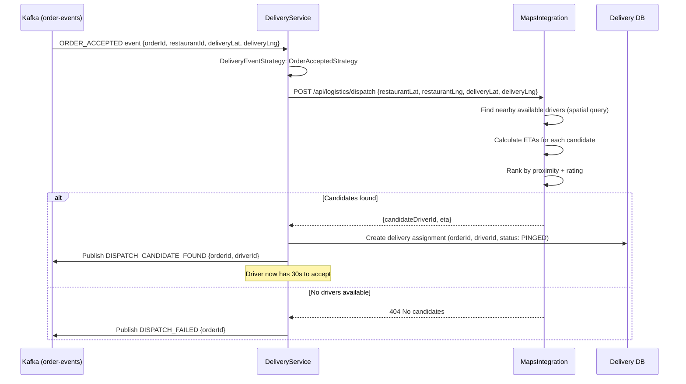
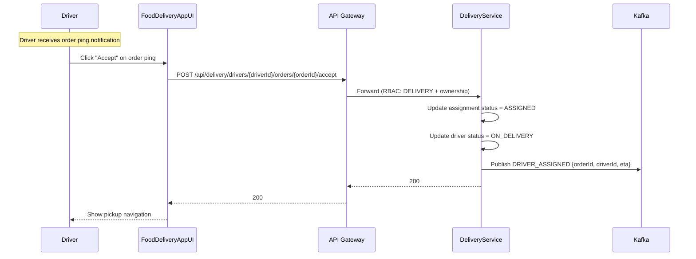
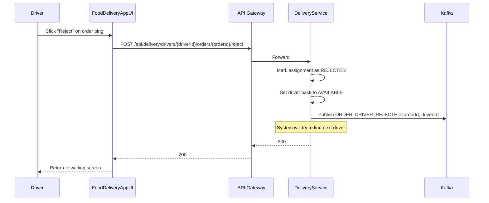
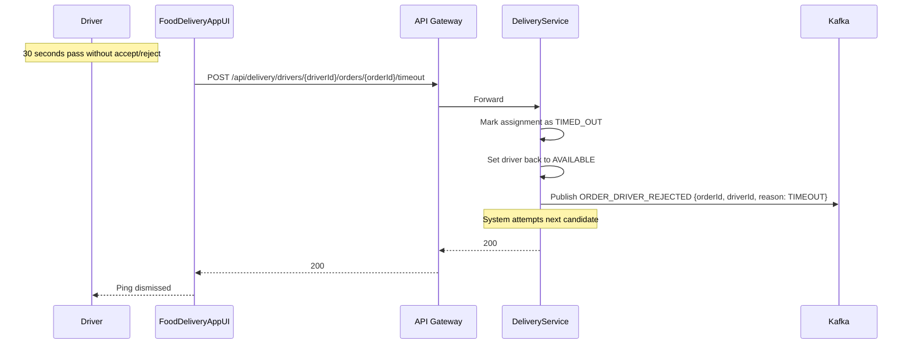
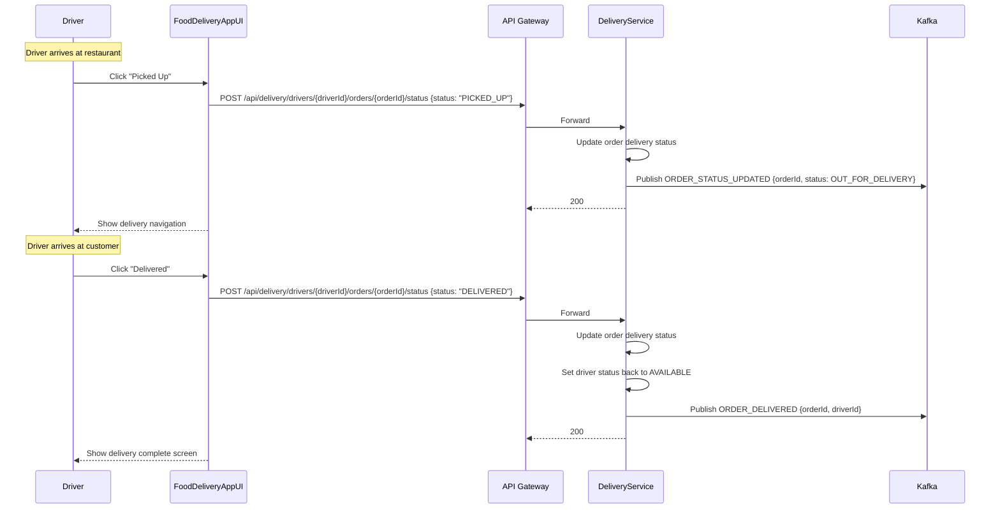
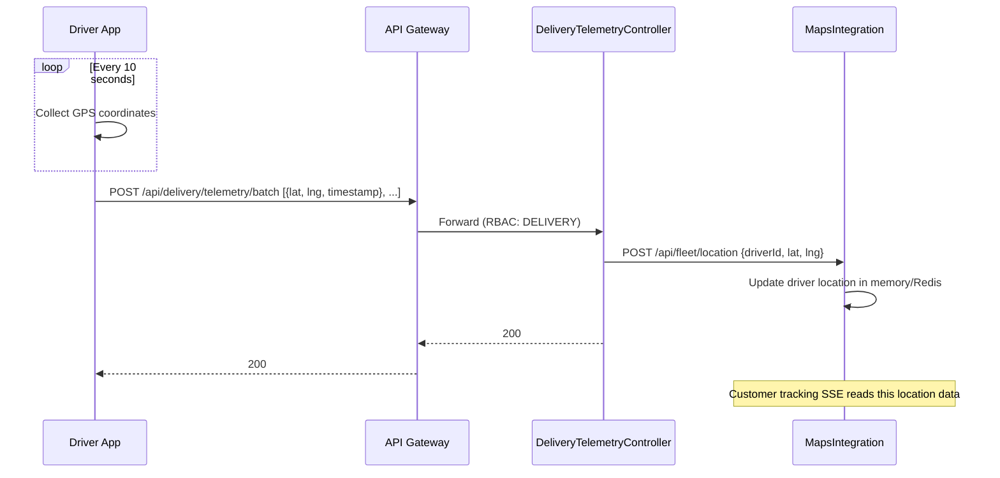
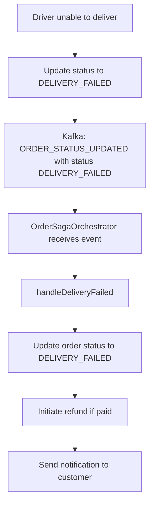

# 5. Delivery Executive Flows

## 5.1 Driver Onboarding

## 5.2 Toggle Availability

## 5.3 Order Dispatch — Finding a Driver

## 5.4 Driver Accepts Order Ping

## 5.5 Driver Rejects Order Ping

## 5.6 Driver Ping Timeout

## 5.7 Driver Updates Order Status (Pickup → Delivery)

## 5.8 Location Telemetry (Batch Upload)

## 5.9 Delivery Failed

