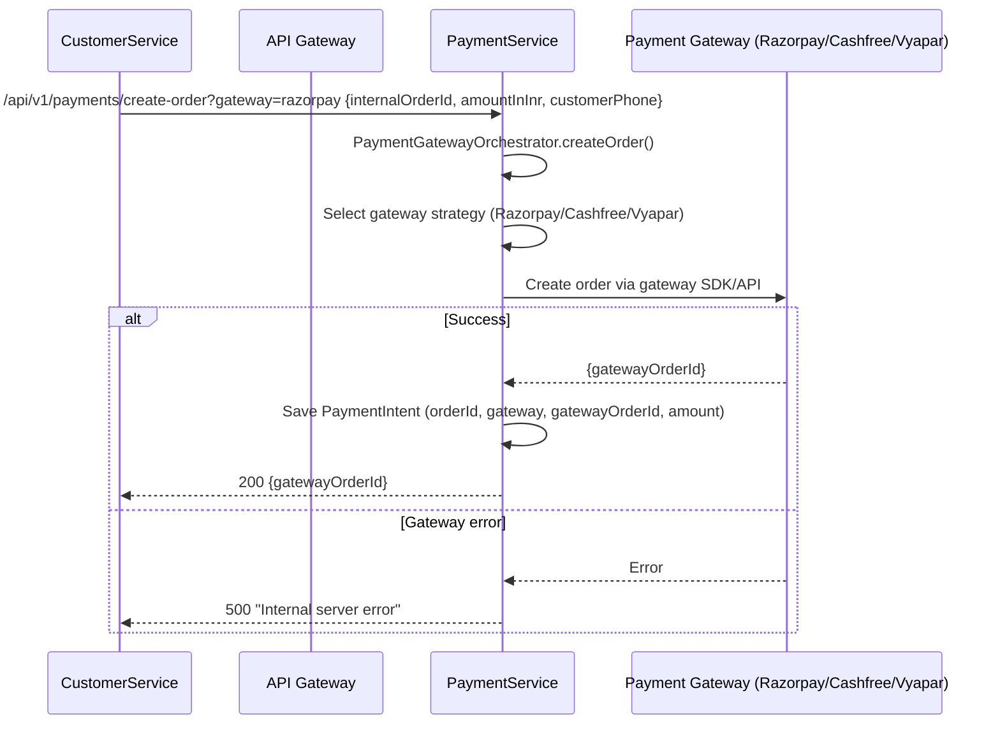
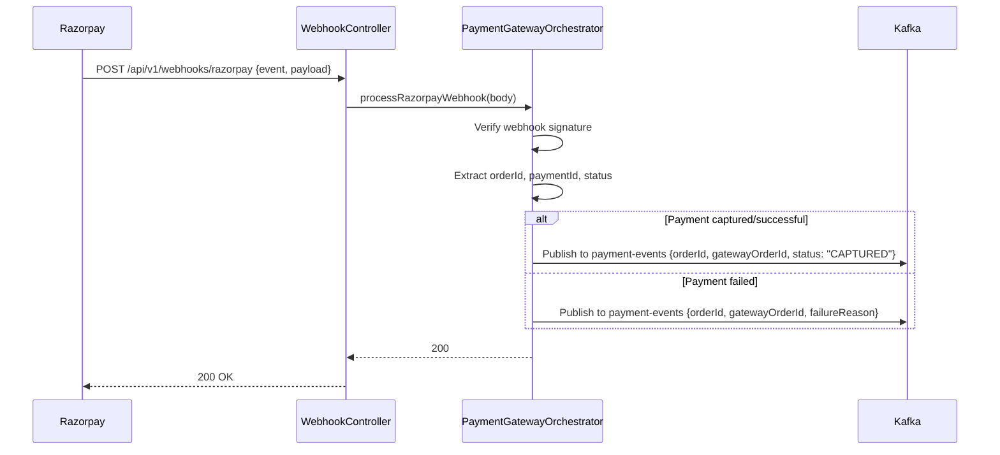
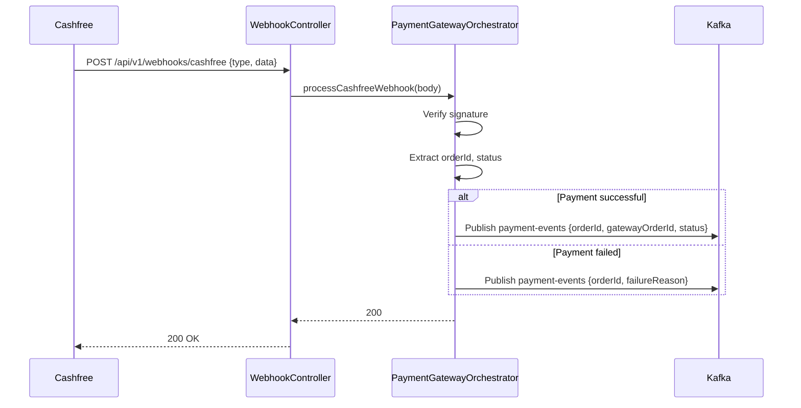
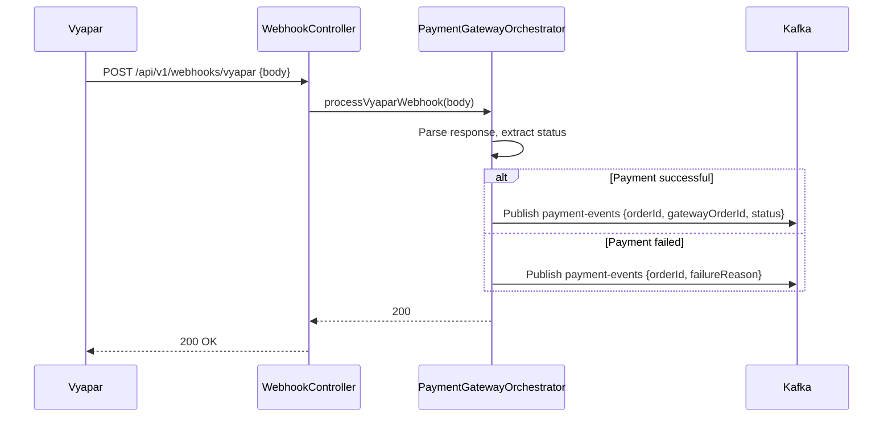
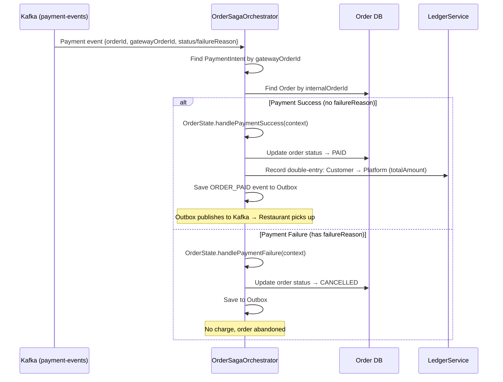
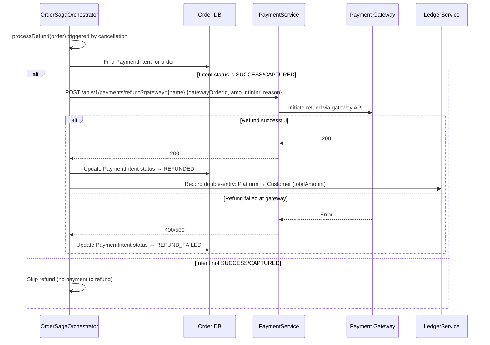
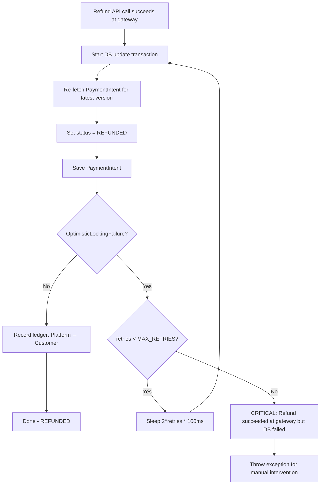
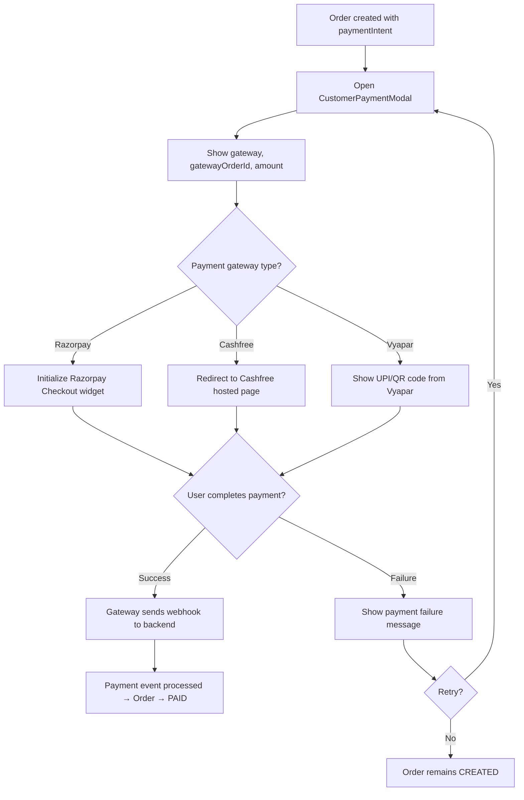

# 6. Payment Flows

## 6.1 Create Payment Order

## 6.2 Payment Webhook — Success (Razorpay)

## 6.3 Payment Webhook — Success (Cashfree)

## 6.4 Payment Webhook — Success (Vyapar)

## 6.5 Payment Event Processing (in CustomerService Saga)

## 6.6 Refund Flow

## 6.7 Refund with Optimistic Lock Retry

## 6.8 Frontend Payment Modal Flow

