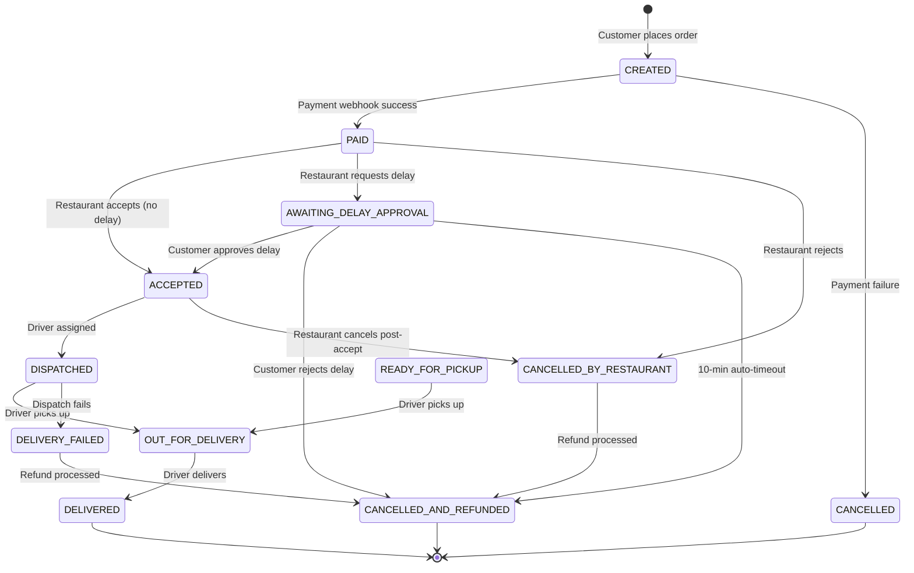
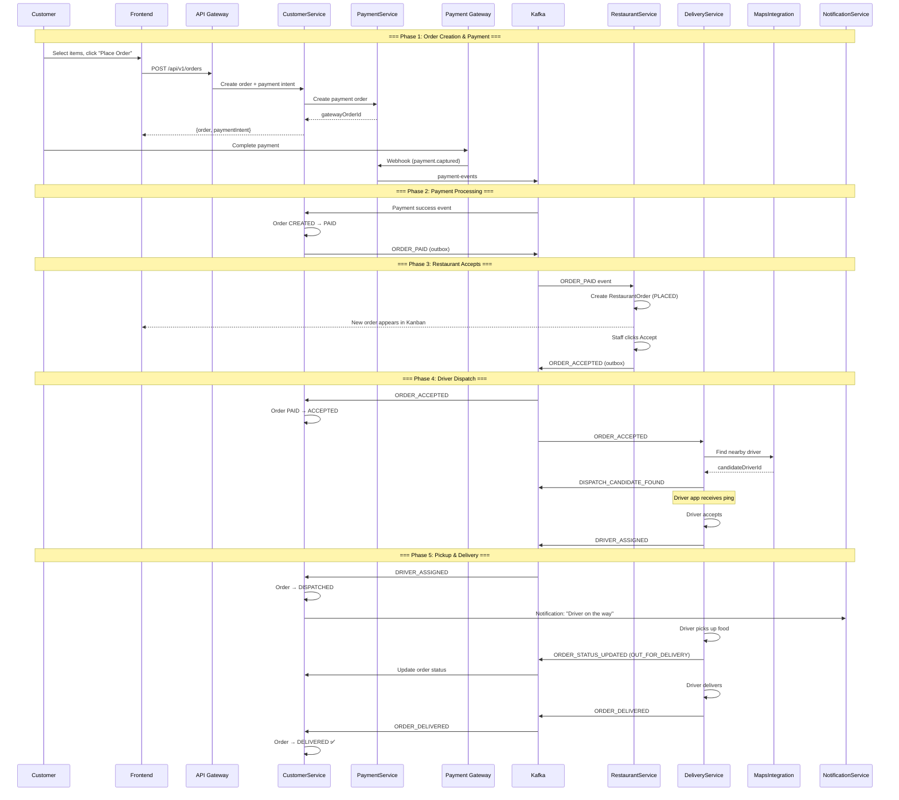
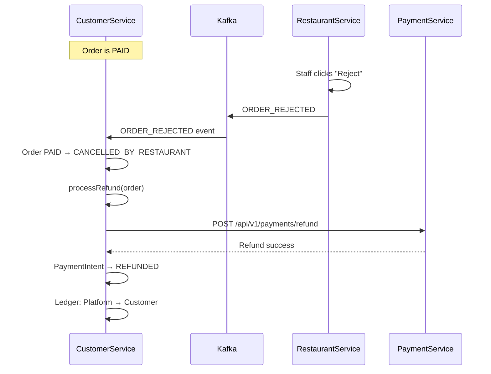
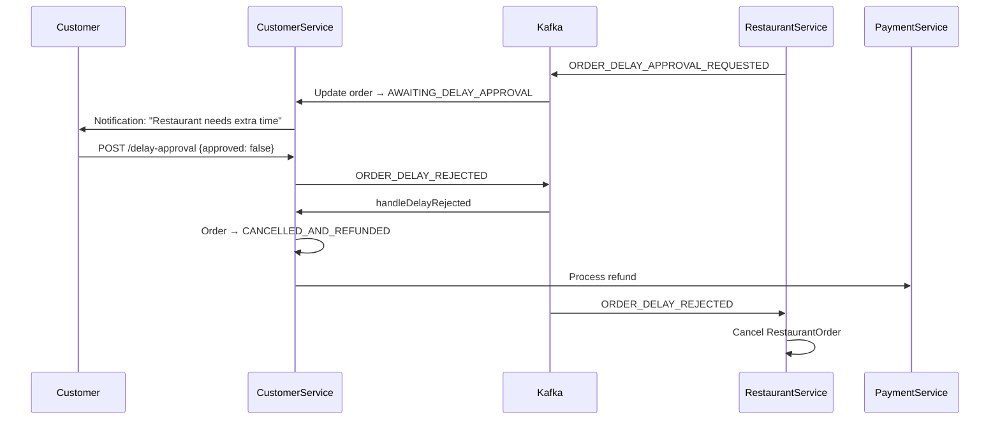
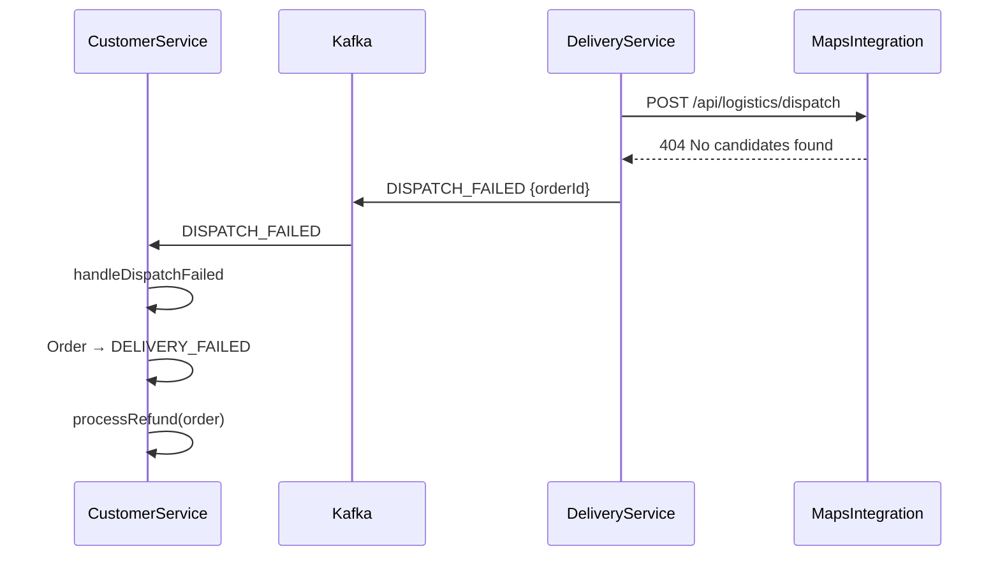
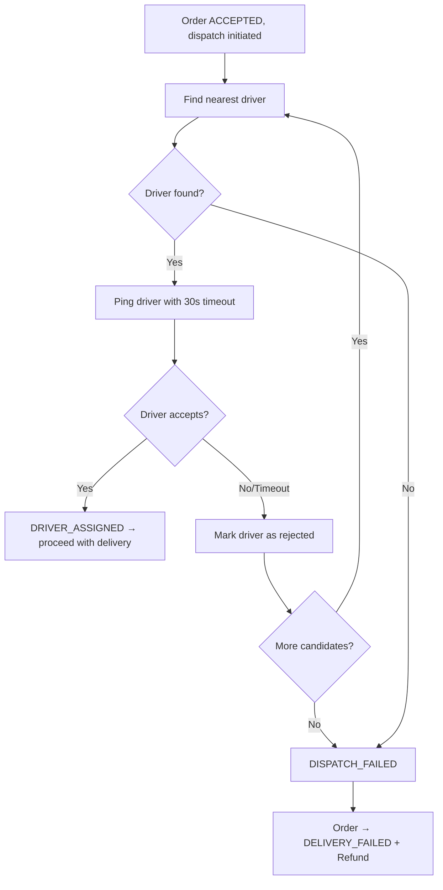
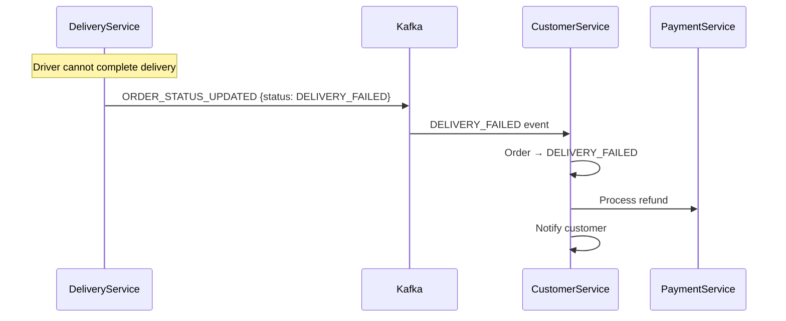

# 7. End-to-End Order Lifecycle

## 7.1 Complete Order State Machine

## 7.2 Happy Path — End-to-End Sequence

## 7.3 Unhappy Path — Restaurant Rejects Order

## 7.4 Unhappy Path — Delay Rejected by Customer

## 7.5 Unhappy Path — Dispatch Fails (No Drivers Available)

## 7.6 Unhappy Path — All Drivers Reject/Timeout

## 7.7 Unhappy Path — Delivery Failed

