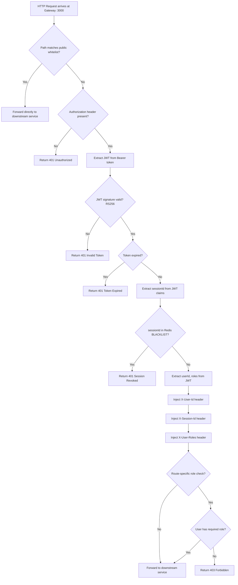
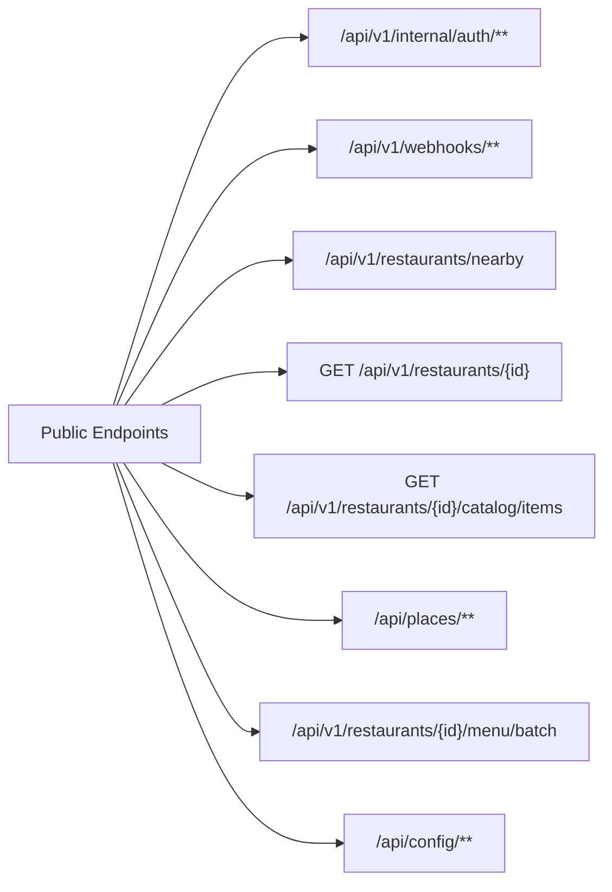
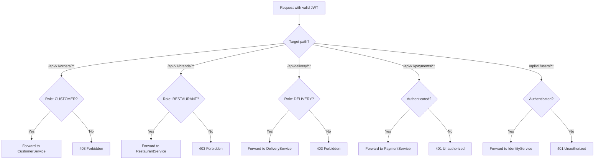
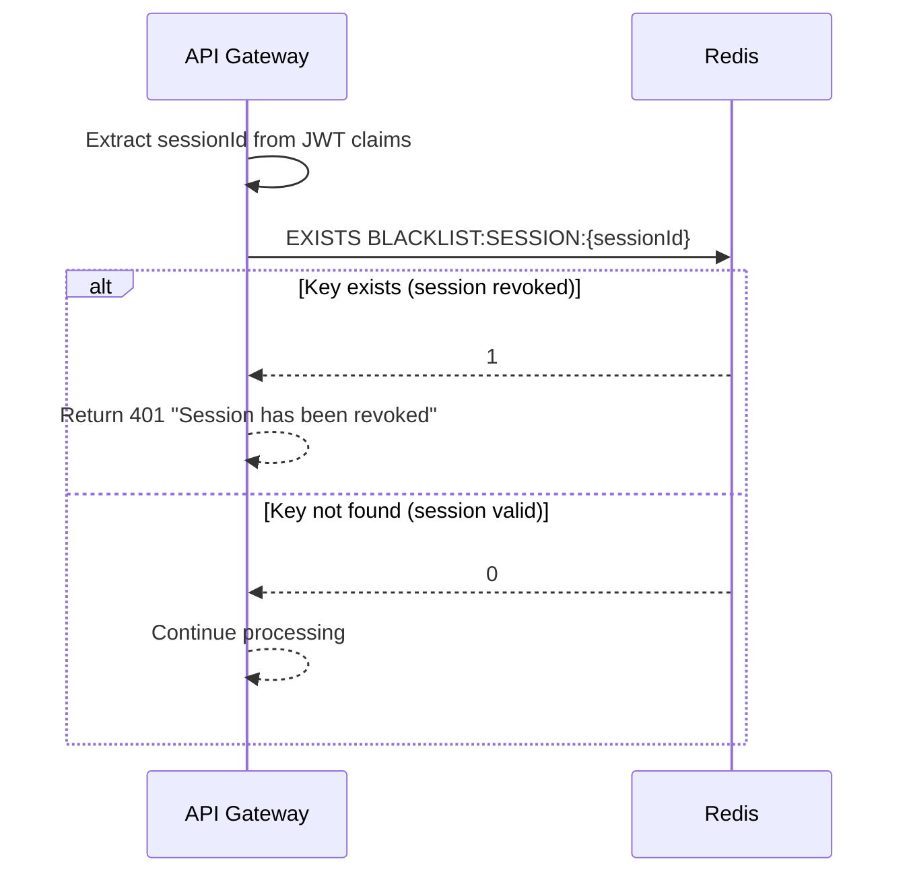

# 8. API Gateway Flows

## 8.1 Request Processing Pipeline

## 8.2 Public Endpoint Whitelist

## 8.3 Role-Based Route Enforcement

## 8.4 Session Blacklist Check Detail

## 8.5 Service Routing Table

```mermaid
flowchart TD
    A[Gateway Routes] --> B["/api/v1/internal/**" → IdentityService :8091]
    A --> C["/api/v1/users/**" → IdentityService :8091]
    A --> D["/api/v1/customers/**" → CustomerService :8093]
    A --> E["/api/v1/orders/**" → CustomerService :8093]
    A --> F["/api/v1/brands/**" → RestaurantService :8094]
    A --> G["/api/v1/restaurants/**" → RestaurantService :8094]
    A --> H["/api/v1/outlets/**" → RestaurantService :8094]
    A --> I["/api/delivery/**" → DeliveryService :8095]
    A --> J["/api/v1/payments/**" → PaymentService :8096]
    A --> K["/api/v1/webhooks/**" → PaymentService :8096]
    A --> L["/api/places/**" → CustomerService :8093 → MapsIntegration :8097]
    A --> M["/api/fleet/**" → MapsIntegration :8097]
    A --> N["/api/logistics/**" → MapsIntegration :8097]
```

