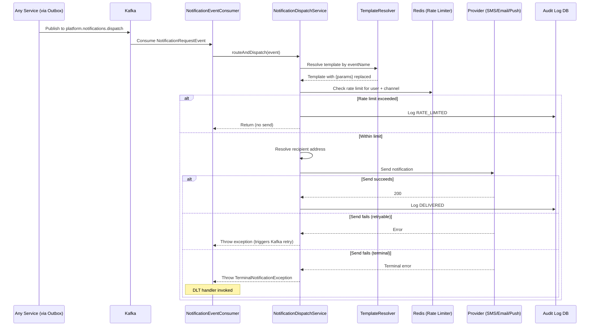
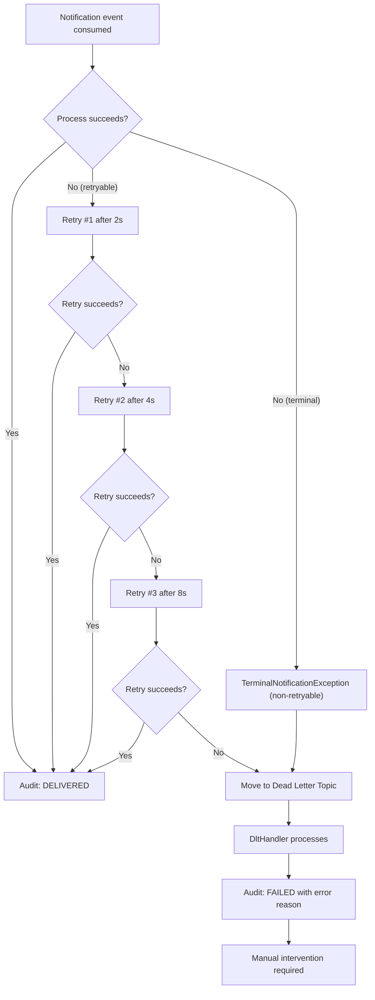
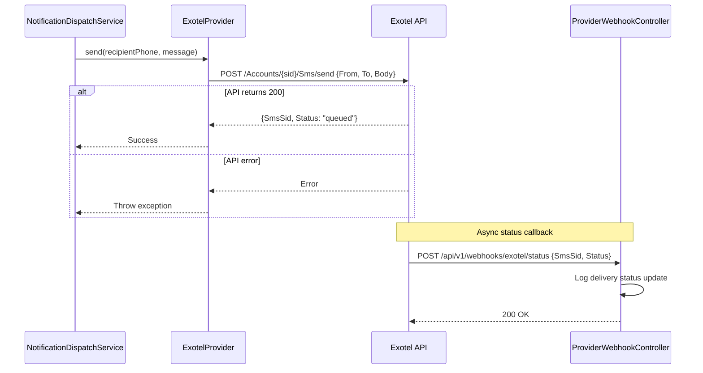
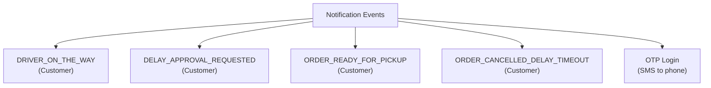
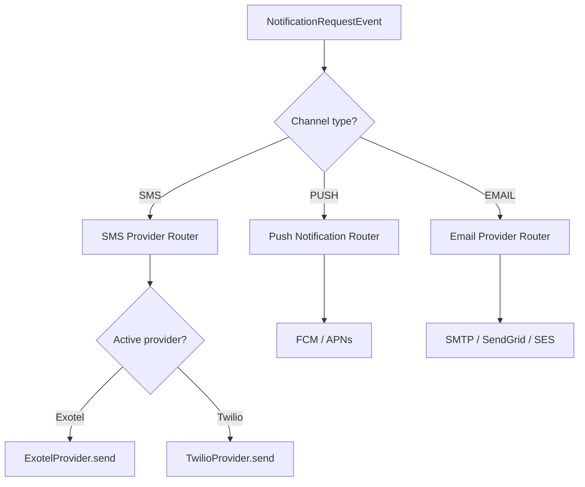

# 9. Notification Flows

## 9.1 Notification Dispatch Pipeline

## 9.2 Kafka Retry + Dead Letter Topic

## 9.3 SMS Notification Flow (Exotel)

## 9.4 Notification Event Types

## 9.5 Notification Channel Routing

