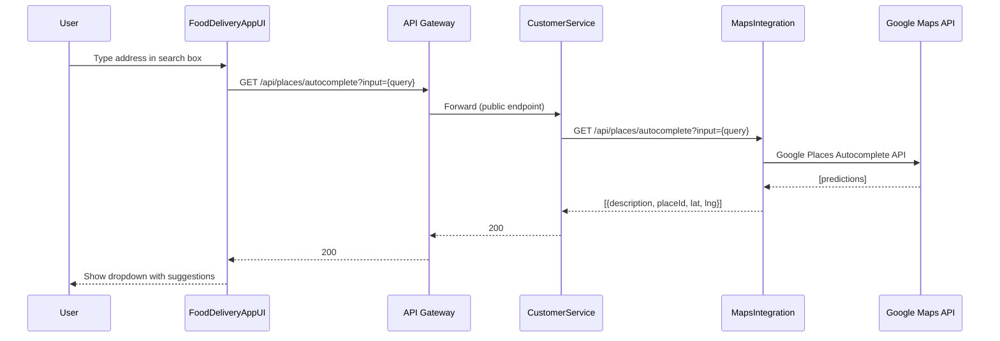
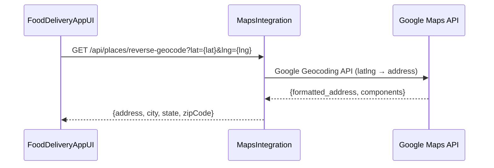
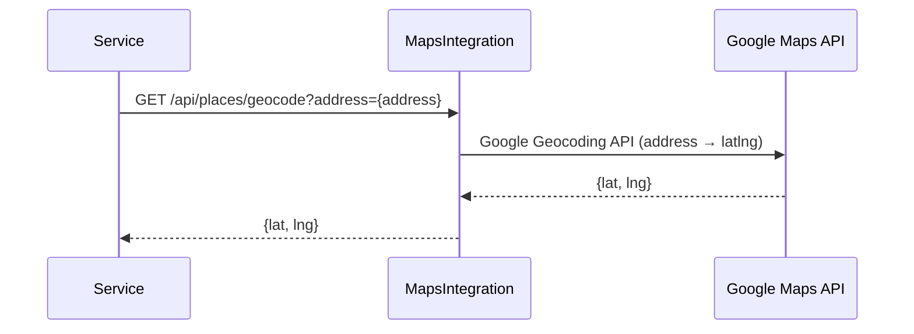
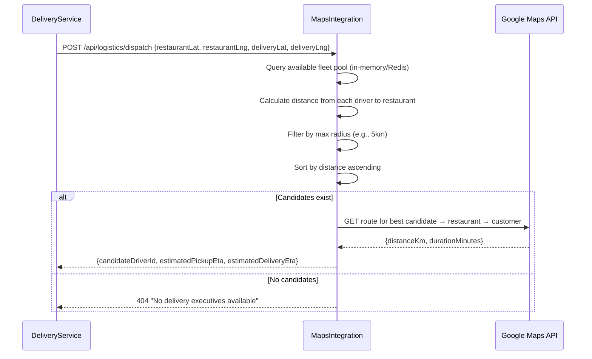
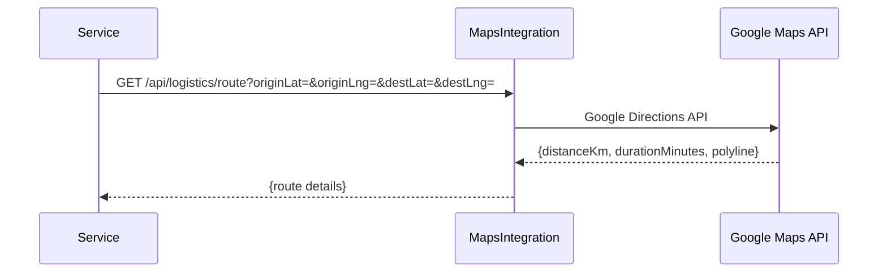
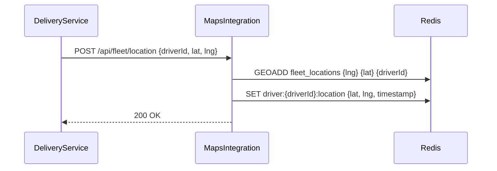
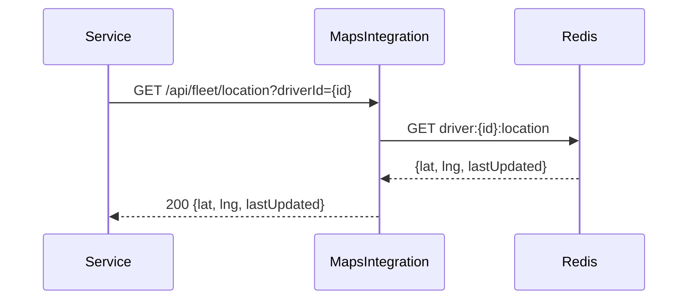
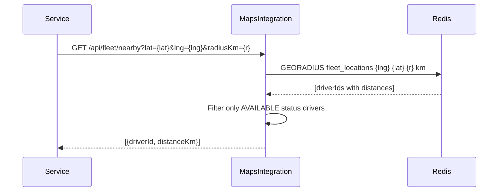
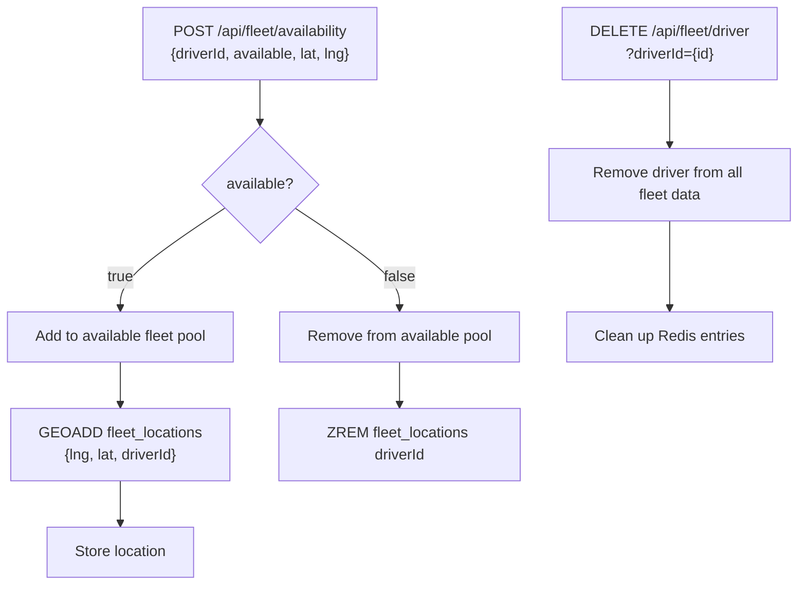
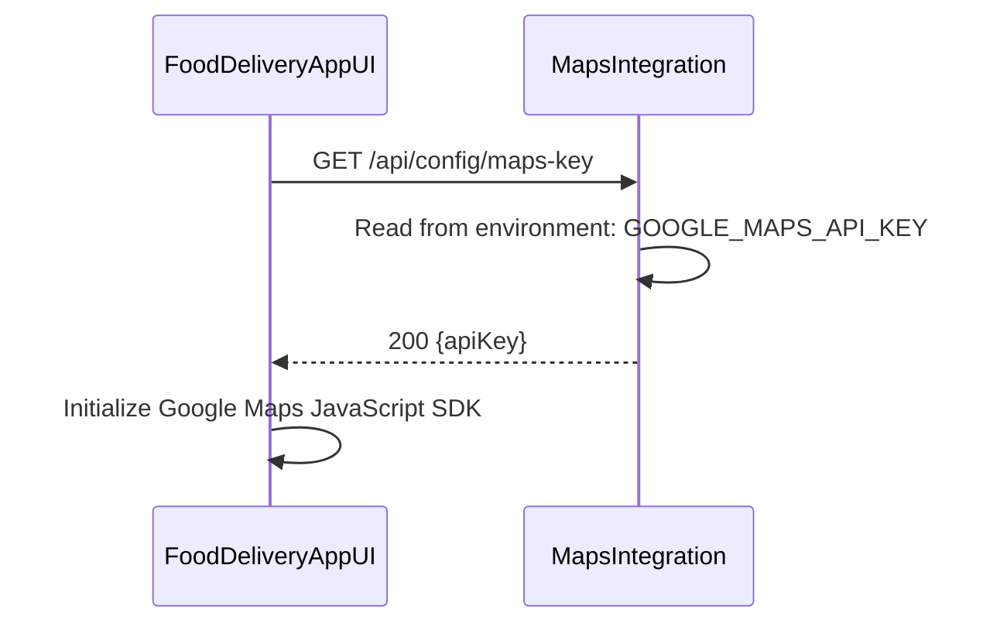

# 10. Maps & Logistics Flows

## 10.1 Places Autocomplete

## 10.2 Reverse Geocode

## 10.3 Forward Geocode

## 10.4 Dispatch — Find Nearest Driver

## 10.5 Route Calculation

## 10.6 Fleet Location Update

## 10.7 Fleet Location Query

## 10.8 Find Nearby Drivers

## 10.9 Fleet Availability Management

## 10.10 Maps API Key Fetch

