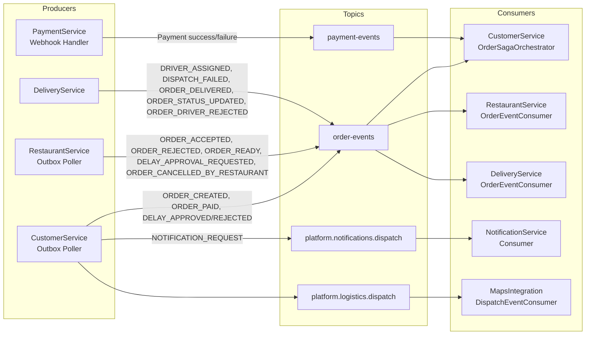
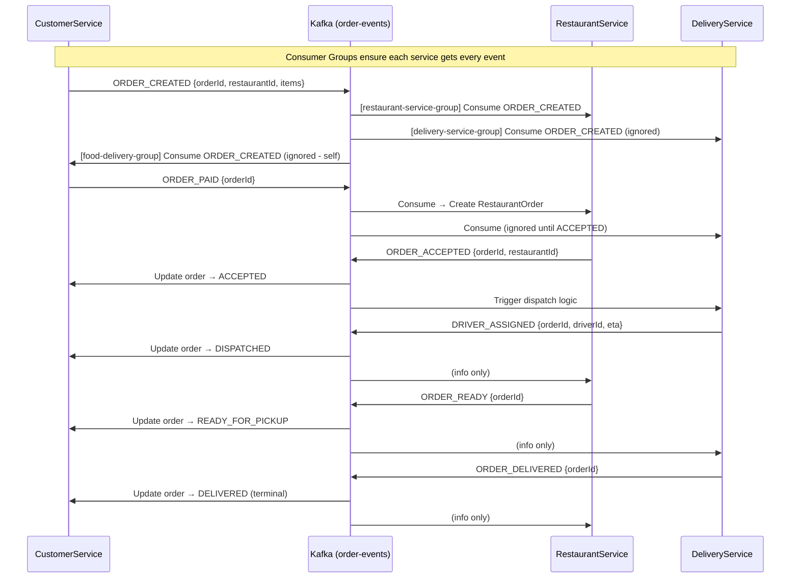
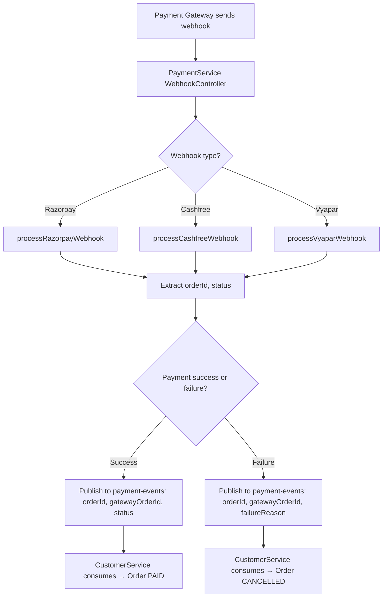
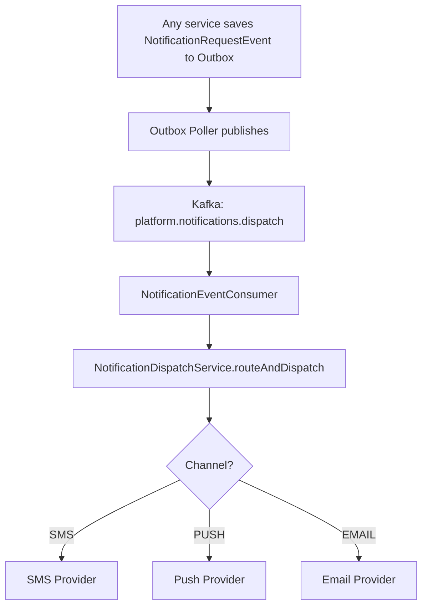
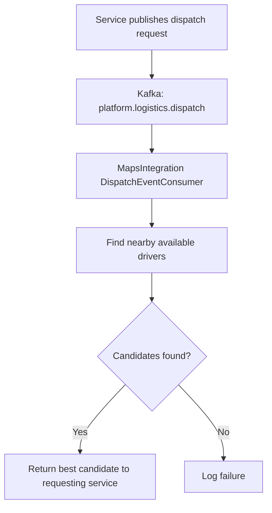
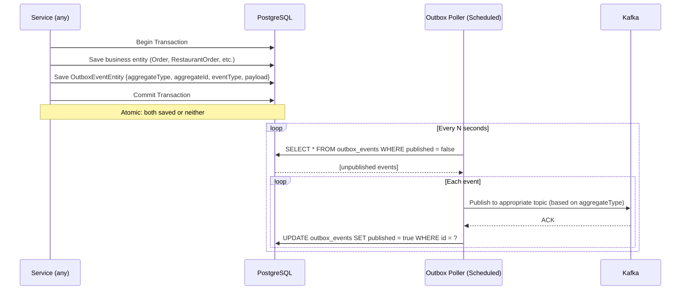

# 11. Kafka Event Flows (Cross-Service Messaging)

## 11.1 Kafka Topics & Producers/Consumers



## 11.2 Order Events Topic — Event Flow



## 11.3 Payment Events Topic



## 11.4 Notification Dispatch Topic



## 11.5 Logistics Dispatch Topic



## 11.6 Outbox Pattern — Event Publishing



## 11.7 Consumer Group Isolation

```mermaid
flowchart TD
    A["order-events topic\n(6 partitions)"] --> B["food-delivery-group\n(CustomerService)"]
    A --> C["restaurant-service-group\n(RestaurantService)"]
    A --> D["delivery-service-group\n(DeliveryService)"]

    E["payment-events topic"] --> B

    F["platform.notifications.dispatch topic"] --> G["notification-service-group\n(NotificationService)"]

    H["platform.logistics.dispatch topic"] --> I["maps-integration-group\n(MapsIntegration)"]

    Note over B,D: Each group gets ALL messages independently
    Note over B,D: Partitions distributed among group members
```
