# 12. Error & Edge Cases

## 12.1 OTP Rate Limiting

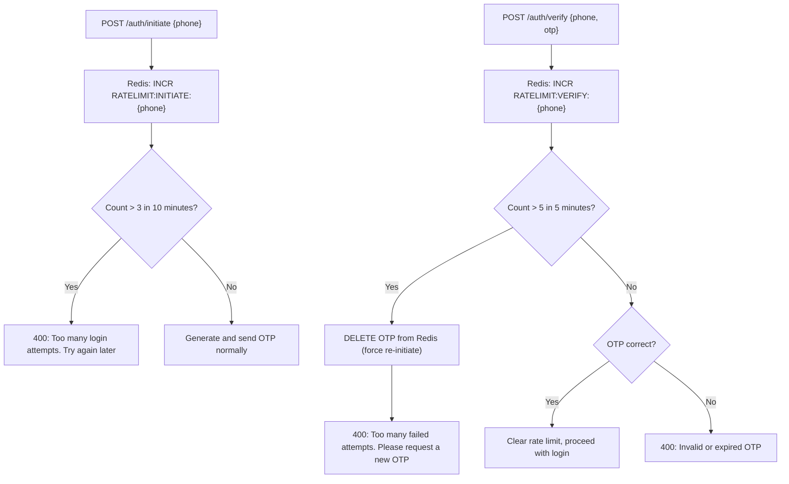

## 12.2 JWT Expiration During Active Session

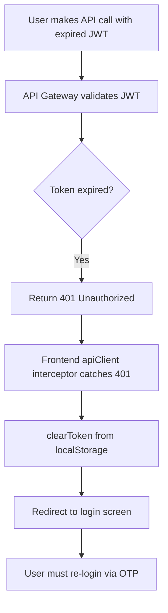

## 12.3 Session Blacklisted After Device Eviction

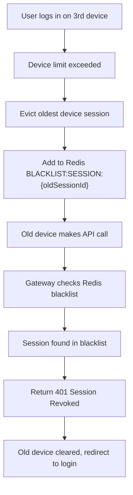

## 12.4 Optimistic Locking Conflicts (Order Events)

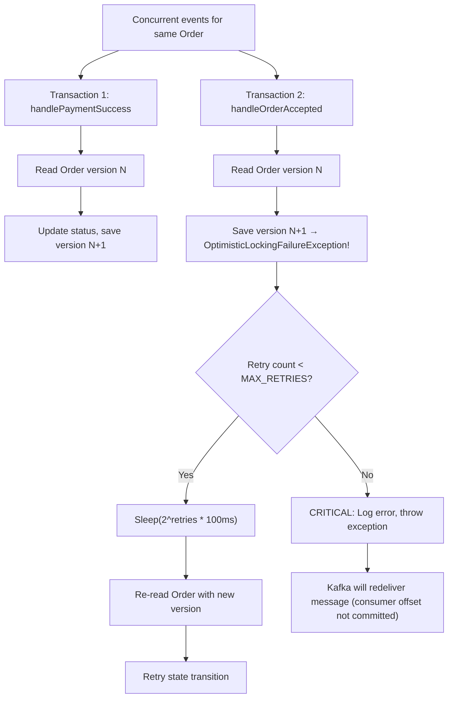

## 12.5 Illegal State Transition

```mermaid
flowchart TD
    A[Event arrives for an Order] --> B[Load current OrderState]
    B --> C[Call handler for event type]
    C --> D{Transition allowed?}
    D -- Yes --> E[Update order status, save]
    D -- No --> F["Throw IllegalStateTransitionException"]
    F --> G["Log: ILLEGAL_STATE_TRANSITION"]
    G --> H[Event silently dropped]
    H --> I[Order state unchanged]

    Note over D: Examples of illegal transitions:
    Note over D: DELIVERED → ACCEPTED
    Note over D: CANCELLED → PAID
    Note over D: READY_FOR_PICKUP → CREATED
```

## 12.6 Payment Webhook Arrives Before Order Exists

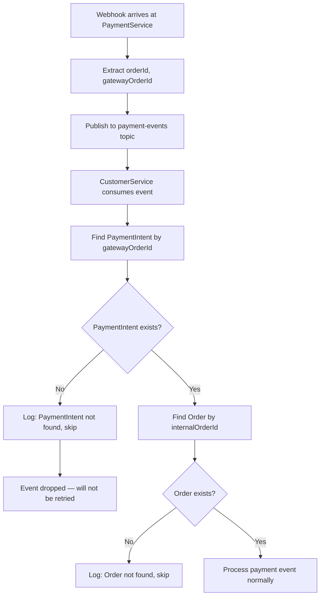

## 12.7 Restaurant Validation Failures

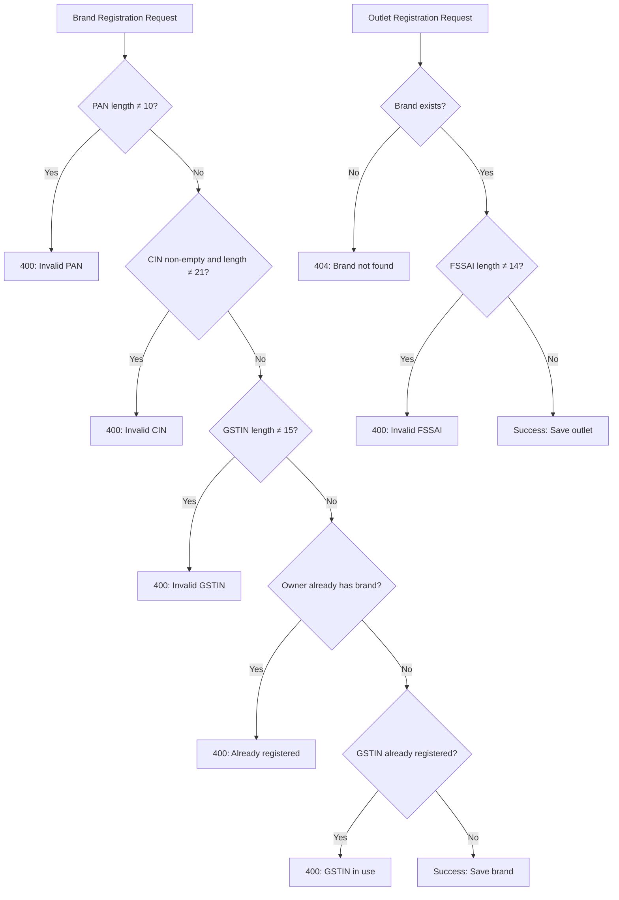

## 12.8 Network Failure Between Services

```mermaid
flowchart TD
    A[CustomerService calls RestaurantService API] --> B{HTTP call succeeds?}
    B -- Yes --> C[Process response normally]
    B -- No (timeout) --> D[Catch RestClientException]
    D --> E[Return 500 or degraded response]

    F[CustomerService calls PaymentService API] --> G{HTTP call succeeds?}
    G -- Yes --> H[Return payment intent to customer]
    G -- No --> I[Return 500 "Failed to create payment"]
    I --> J[Order saved but no payment intent]
    J --> K[Customer must retry order]

    L[OrderSaga calls PaymentService for refund] --> M{Refund API succeeds?}
    M -- Yes --> N[Update PaymentIntent to REFUNDED]
    M -- No --> O[Set PaymentIntent to REFUND_FAILED]
    O --> P[Requires manual intervention]
```

## 12.9 Kafka Consumer Failure & Redelivery

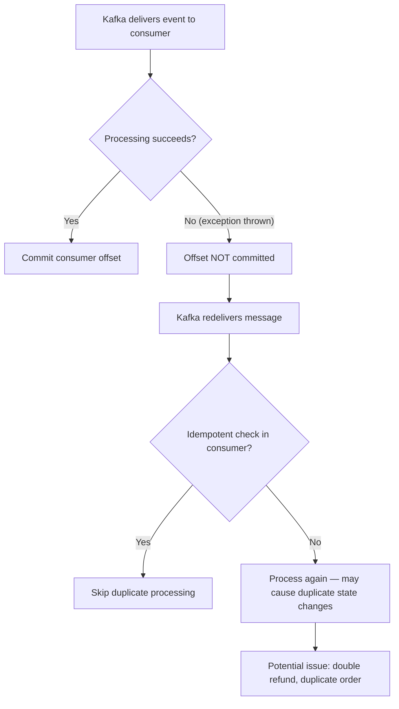

## 12.10 Gateway Routing — Service Down

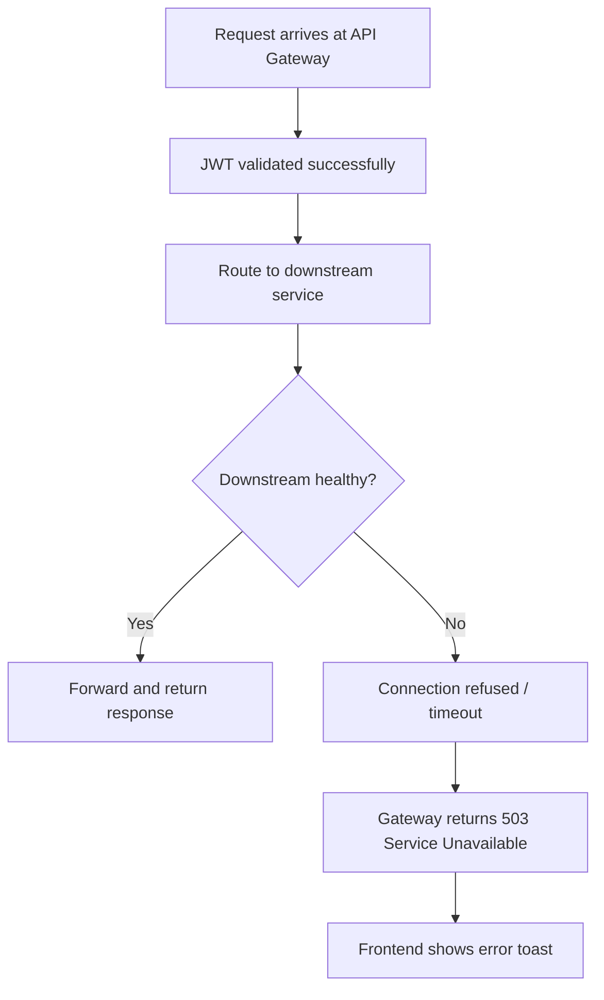

## 12.11 Concurrent Device Login (Same Device ID)

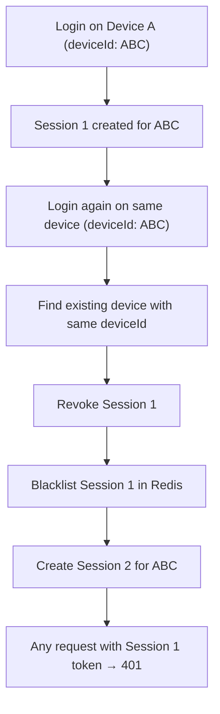

## 12.12 Frontend 401/403 Auto-Logout

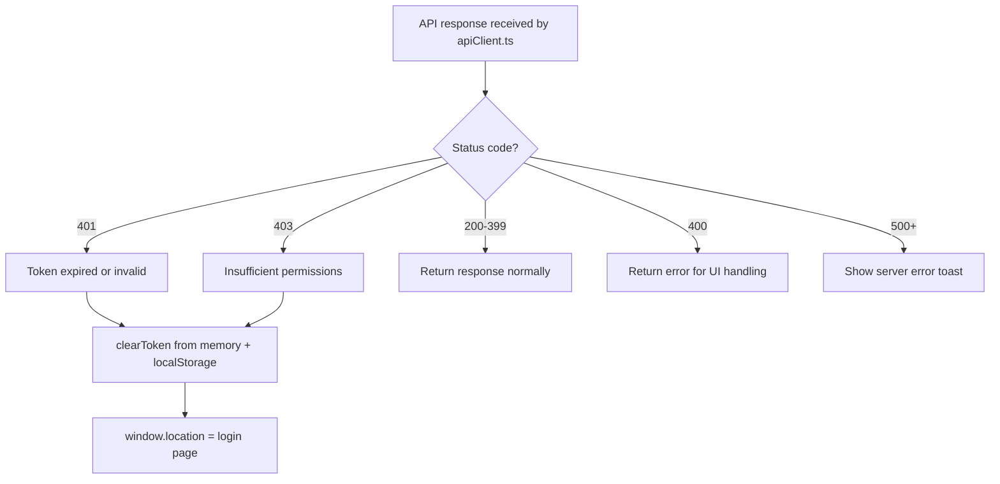

## 12.13 Stale Config Server Data

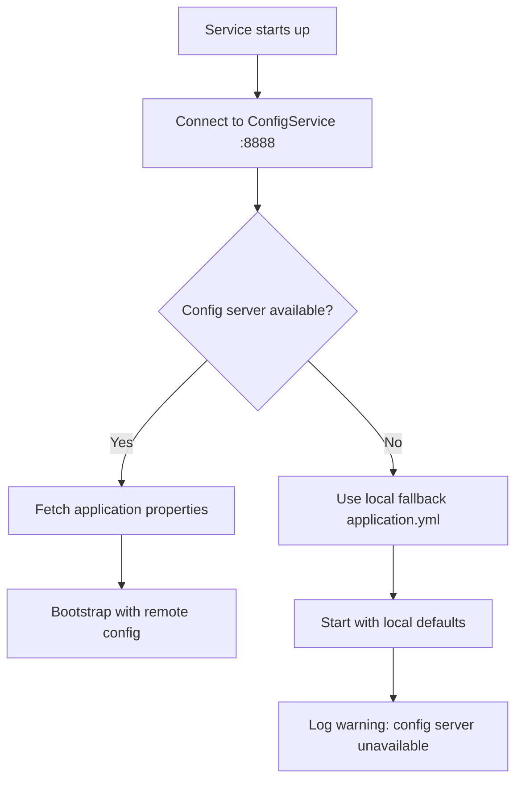

## 12.14 IDOR Protection on Driver Telemetry

```mermaid
flowchart TD
    A["POST /api/v1/delivery/telemetry/batch"] --> B[Extract authId from principal]
    B --> C[Iterate over telemetry events]
    C --> D{event.driverId == authId?}
    D -- No --> E["Log: Unauthorized telemetry push attempt"]
    E --> F[Skip event (IDOR prevented)]
    D -- Yes --> G[Process event normally]
    G --> H[Update Redis geospatial index]
```

## 12.15 Customer Auto-Creation on First Address

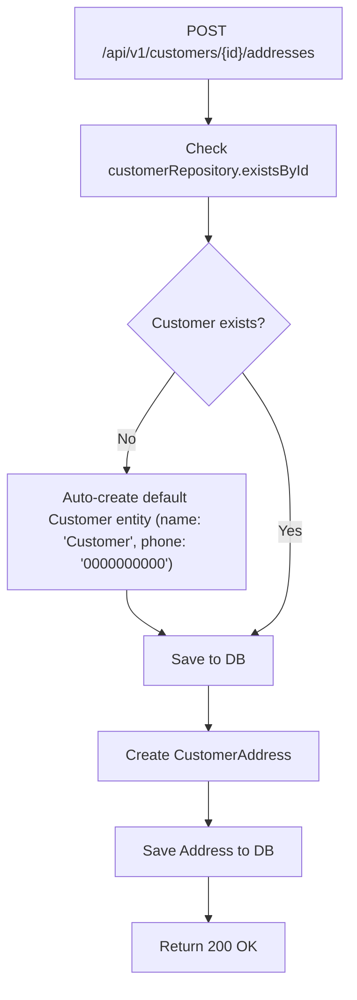

## 12.16 Delivery Partner Unavailable Fallback

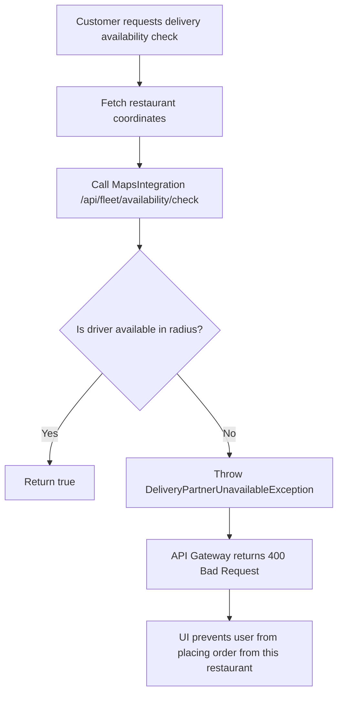

## 12.17 UI Profile Name Enforcement

```mermaid
flowchart TD
    A[User completes OTP Login] --> B[UI checks if profile.name is empty]
    B --> C{Name empty?}
    C -- Yes --> D[Show NamePromptModal (background blurred)]
    D --> E[User enters name and submits]
    E --> F["PUT /api/v1/users/profile/name"]
    F --> G[Save profile in localStorage]
    G --> H[Unlock dashboard]
    C -- No --> H
```
